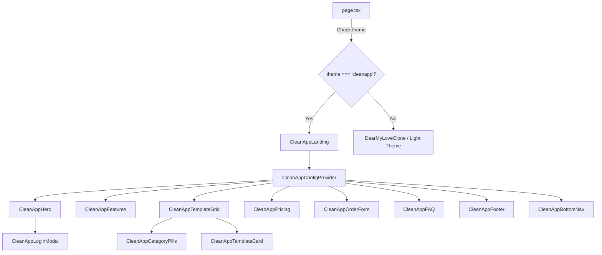

# Design Document: CleanApp Landing Page Theme

## Overview

The CleanApp theme is a new landing page theme option that adopts a clean, modern mobile app design aesthetic inspired by the Katalog ID app mockups. This theme provides a comprehensive customization system where admins can configure all text content, images, and colors to match their brand identity. The theme is designed with a mobile-first approach, featuring card-based layouts, soft pastel color palettes, category pills for filtering, and clean form designs.

The CleanApp theme will be the third theme option alongside "default" (DearMyLove clone) and "neumorphism" (classic light theme). Each member can select their preferred theme, and admins can fully customize the theme's appearance through a dedicated configuration interface.

**Key Design Principles:**
- **Mobile-First**: Optimized for mobile devices with responsive scaling for tablets and desktops
- **Card-Based Layouts**: Clean whitespace with elevated card components
- **Soft Pastel Aesthetics**: Gentle color palette (pink, blue, cream, gold)
- **Comprehensive Customization**: Every text, image, and color can be configured
- **Performance-Optimized**: Lazy loading, optimized images, minimal layout shifts

## Architecture

### High-Level System Architecture

```mermaid
graph TD
    A[Admin Dashboard] -->|Configure Theme| B[Theme Config API]
    B -->|Save to DB| C[Member.landingPageConfig JSON]
    D[Landing Page] -->|Fetch Config| E[/api/public/settings]
    E -->|Return Config| D
    D -->|Render| F[CleanApp Theme Components]
    F -->|Apply| G[Customized Content]
    F -->|Apply| H[Customized Images]
    F -->|Apply| I[Customized Colors]
    
    J[ThemeContext] -->|Manage State| D
    K[CleanAppConfigContext] -->|Provide Config| F
```

### Component Hierarchy



### Data Flow Sequence

```mermaid
sequenceDiagram
    participant Admin as Admin Dashboard
    participant API as Theme Config API
    participant DB as PostgreSQL Database
    participant Landing as Landing Page
    participant Context as CleanAppConfigContext
    participant Components as Theme Components

    Admin->>API: POST /api/admin/theme-config
    API->>DB: UPDATE Member.landingPageConfig
    DB-->>API: Success
    API-->>Admin: Config Saved

    Landing->>API: GET /api/public/settings
    API->>DB: SELECT landingPageConfig
    DB-->>API: Return Config JSON
    API-->>Landing: Theme Config
    Landing->>Context: Initialize with Config
    Context->>Components: Provide Config Data
    Components->>Components: Render with Custom Content/Images/Colors


## Correctness Properties

*A property is a characteristic or behavior that should hold true across all valid executions of a system—essentially, a formal statement about what the system should do. Properties serve as the bridge between human-readable specifications and machine-verifiable correctness guarantees.*

### Property 1: Theme Selection Persistence

*For any* member and theme selection, storing the theme selection then retrieving the member's profile should return the same theme value.

**Validates: Requirements 1.2**

### Property 2: Theme-Specific Rendering

*For any* member with CleanApp theme selected, rendering the landing page should produce output containing CleanApp-specific components and not contain components from other themes.

**Validates: Requirements 1.3, 1.4**

### Property 3: Configuration Structure Validation

*For any* configuration object, the Theme_Config_API validation should accept valid configurations and reject invalid configurations with descriptive error messages.

**Validates: Requirements 2.2**

### Property 4: Configuration Persistence Round-Trip

*For any* valid theme configuration (including text content, image URLs, and color values), saving the configuration then retrieving it should return an equivalent configuration object.

**Validates: Requirements 2.3, 3.4, 4.4, 5.4**

### Property 5: Default Configuration Application

*For any* member without custom configuration, loading the landing page should apply all default CleanApp theme values for text, images, colors, features, pricing, and FAQ items.

**Validates: Requirements 2.5, 20.5**

### Property 6: Configuration Rendering Consistency

*For any* customized configuration (text, images, or colors), rendering the landing page should produce output that contains all customized values in the appropriate locations.

**Validates: Requirements 3.5, 4.5, 5.5**

### Property 7: Live Preview Updates

*For any* configuration change in the admin dashboard (text, images, or colors), the live preview should update to reflect the change immediately.

**Validates: Requirements 3.2, 5.3, 17.3**

### Property 8: Image Validation

*For any* image upload, the system should accept valid image formats and sizes while rejecting invalid images with descriptive error messages.

**Validates: Requirements 4.2**

### Property 9: Image Lazy Loading

*For any* rendered page configuration, all image elements in the output should have lazy loading attributes enabled.

**Validates: Requirements 4.6, 18.1**

### Property 10: Color Contrast Validation

*For any* color combination in the theme configuration, the system should validate that contrast ratios meet accessibility requirements (4.5:1 for normal text, 3:1 for large text).

**Validates: Requirements 5.6, 19.2**

### Property 11: Responsive Breakpoint Behavior

*For any* viewport width, the system should apply the correct layout: mobile layout for width < 768px, tablet layout for 768px ≤ width ≤ 1024px, and desktop layout for width > 1024px.

**Validates: Requirements 6.2, 6.3, 6.4**

### Property 12: Touch-Friendly Element Sizing

*For any* interactive element in the rendered page, the element should have dimensions of at least 44x44 pixels to ensure touch-friendly interaction.

**Validates: Requirements 6.5**

### Property 13: Card Styling Consistency

*For any* set of card components in the same section, all cards should have consistent elevation shadows, border radius, and spacing properties.

**Validates: Requirements 7.2, 7.3**

### Property 14: Interactive Card Feedback

*For any* card component containing interactive content, the card should provide visual feedback (hover or touch state) when interacted with.

**Validates: Requirements 7.4**

### Property 15: Card Responsive Adaptation

*For any* viewport size change, card components should adapt their layout appropriately to maintain readability and usability.

**Validates: Requirements 7.5, 11.5, 14.4**

### Property 16: Template Category Filtering

*For any* category selection and set of templates, the displayed templates should include only those matching the selected category, and all matching templates should be displayed.

**Validates: Requirements 8.3**

### Property 17: Active Filter Visual Feedback

*For any* active category filter, the corresponding Category_Pill should have visual styling that distinguishes it from inactive filters.

**Validates: Requirements 8.5**

### Property 18: Template Card Content Completeness

*For any* template, the rendered Template_Card should contain the template preview image, title, and category information.

**Validates: Requirements 8.6**

### Property 19: Component Content Completeness

*For any* configured component (hero, feature item, pricing tier, footer), the rendered output should contain all required elements as specified in the configuration.

**Validates: Requirements 9.1, 9.2, 10.2, 11.2, 14.1**

### Property 20: Modal Interaction Behavior

*For any* login button click, the CleanApp_Login_Modal should appear, and for any successful authentication, the modal should close and the UI should update to reflect authenticated state.

**Validates: Requirements 9.3, 9.5**

### Property 21: Feature Count Validation

*For any* feature configuration, the system should accept configurations with 3 to 6 feature items and reject configurations outside this range with descriptive error messages.

**Validates: Requirements 10.4**

### Property 22: Recommended Tier Highlighting

*For any* pricing configuration where a tier is marked as recommended, the rendered output should apply visual highlighting to that tier.

**Validates: Requirements 11.4**

### Property 23: Form Validation Behavior

*For any* form submission, the system should validate all required fields, accepting complete valid submissions and rejecting incomplete or invalid submissions with descriptive error messages.

**Validates: Requirements 12.2**

### Property 24: Form Submission Success Handling

*For any* successful form submission, the system should display a success message and clear all form fields.

**Validates: Requirements 12.4**

### Property 25: Form Submission Error Handling

*For any* failed form submission, the system should display an error message with actionable guidance for the user.

**Validates: Requirements 12.5**

### Property 26: Form Input Type Appropriateness

*For any* form field, the rendered input element should use an input type appropriate for the field's purpose (email for email, tel for phone, etc.).

**Validates: Requirements 12.6**

### Property 27: FAQ Accordion Behavior

*For any* FAQ item click, the clicked item should expand to show its answer, and all other FAQ items should collapse to hide their answers.

**Validates: Requirements 13.3**

### Property 28: FAQ Count Validation

*For any* FAQ configuration, the system should accept configurations with 3 to 10 FAQ items and reject configurations outside this range with descriptive error messages.

**Validates: Requirements 13.5**

### Property 29: Footer Social Media Links

*For any* social media configuration, the rendered footer should contain links with URLs matching the configured values.

**Validates: Requirements 14.2**

### Property 30: Footer Dynamic Year Display

*For any* render time, the footer should display the current year in the copyright information.

**Validates: Requirements 14.3**

### Property 31: Footer Color Palette Application

*For any* customized color palette, the rendered footer should use colors from that palette for consistent branding.

**Validates: Requirements 14.5**

### Property 32: Bottom Navigation Positioning

*For any* mobile viewport (width < 768px), the Bottom_Nav should be positioned fixed at the bottom of the viewport.

**Validates: Requirements 15.1**

### Property 33: Bottom Navigation Scroll Behavior

*For any* navigation item click in the Bottom_Nav, the page should scroll to the corresponding section.

**Validates: Requirements 15.3**

### Property 34: Bottom Navigation Active State

*For any* current scroll position, the Bottom_Nav should highlight the navigation item corresponding to the currently visible section.

**Validates: Requirements 15.4**

### Property 35: Bottom Navigation Responsive Visibility

*For any* viewport width greater than 768px, the Bottom_Nav should be hidden from view.

**Validates: Requirements 15.5**

### Property 36: Context Initialization

*For any* API response containing theme configuration, the CleanApp_Config_Context should be initialized with that configuration data.

**Validates: Requirements 16.2**

### Property 37: Context Data Propagation

*For any* configuration loaded in the CleanApp_Config_Context, all child Theme_Components should have access to that configuration data.

**Validates: Requirements 16.3**

### Property 38: Context State Handling

*For any* loading or error state during configuration fetch, the CleanApp_Config_Context should handle the state appropriately and provide feedback to components.

**Validates: Requirements 16.4**

### Property 39: Configuration Save Confirmation

*For any* configuration save action in the admin dashboard, the system should display a confirmation message to the user.

**Validates: Requirements 17.5**

### Property 40: Accessibility ARIA Labels

*For any* interactive element in the rendered page, the element should have appropriate ARIA labels for screen reader accessibility.

**Validates: Requirements 19.1**

### Property 41: Keyboard Navigation Support

*For any* interactive element in the rendered page, the element should be accessible via keyboard navigation with visible focus indicators.

**Validates: Requirements 19.3, 19.4**

### Property 42: Semantic HTML Structure

*For any* rendered page, the HTML output should use semantic elements (header, nav, main, section, article, footer) for proper document structure.

**Validates: Requirements 19.5**
