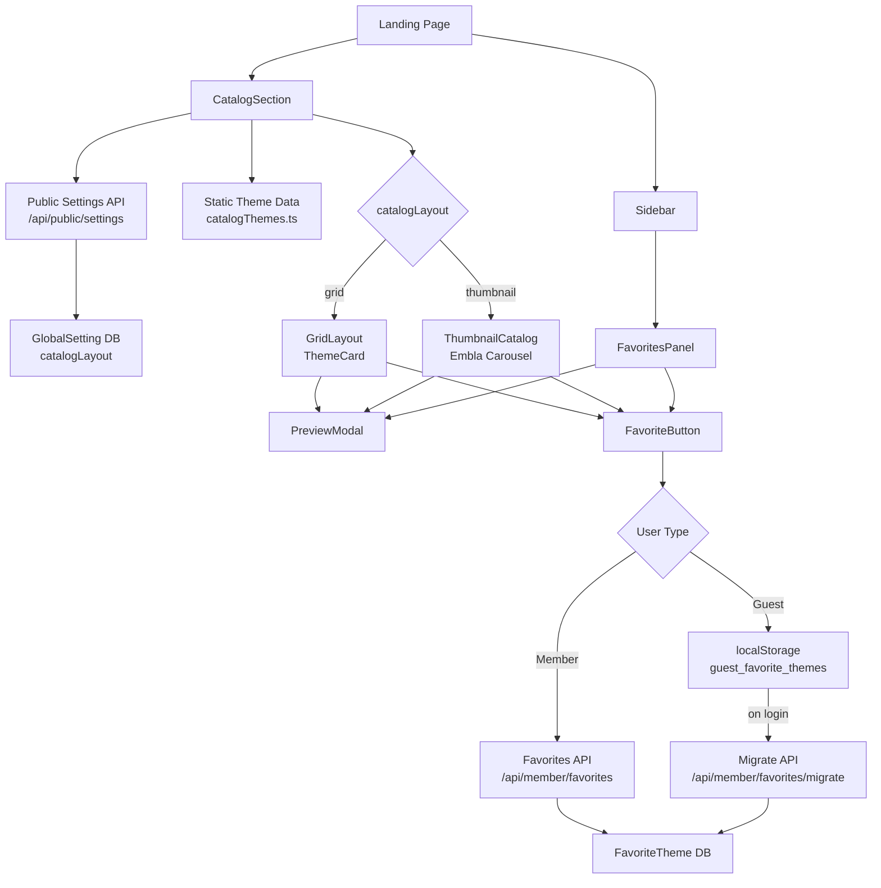
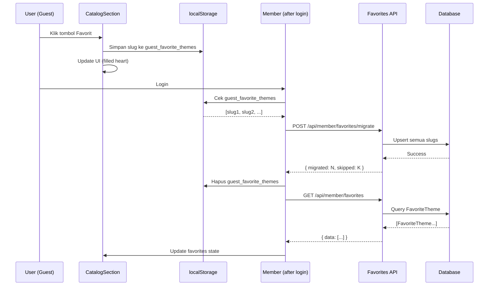

# Design Document: Invitation Catalog Favorites

## Overview

Fitur ini menambahkan katalog tema undangan yang kaya di landing page dengan dua pilihan layout (grid dan thumbnail), sistem favorit untuk guest dan member, serta panel favorit di sidebar. Data 80+ tema disimpan sebagai static array di kode untuk menghindari ketergantungan pada API eksternal.

**Tech Stack:** Next.js 16, TypeScript, Tailwind CSS, Prisma PostgreSQL, Framer Motion, Sonner (toast), Embla Carousel, fast-check (PBT)

### Tujuan Utama

1. Mengganti sumber data katalog dari API eksternal ke static data lokal
2. Menambah layout thumbnail sebagai alternatif layout grid yang sudah ada
3. Menghadirkan preview tema dalam phone mockup modal tanpa meninggalkan halaman
4. Memungkinkan guest dan member menyimpan tema favorit
5. Menampilkan panel favorit yang dapat diakses dari sidebar

---

## Architecture

### Alur Data Keseluruhan



### Komponen Baru vs Modifikasi

**File Baru:**
- `src/lib/catalogThemes.ts` — static data 80+ tema
- `src/components/catalog/CatalogSection.tsx` — komponen utama katalog (menggantikan yang lama)
- `src/components/catalog/ThemeCard.tsx` — kartu tema untuk grid layout
- `src/components/catalog/ThumbnailCatalog.tsx` — layout thumbnail dengan Embla Carousel
- `src/components/catalog/PreviewModal.tsx` — phone mockup preview modal
- `src/components/catalog/FavoritesPanel.tsx` — panel favorit di sidebar
- `src/app/api/member/favorites/route.ts` — GET, POST favorites
- `src/app/api/member/favorites/[slug]/route.ts` — DELETE favorite
- `src/app/api/member/favorites/migrate/route.ts` — POST migrate

**File yang Dimodifikasi:**
- `prisma/schema.prisma` — tambah model `FavoriteTheme`, field `catalogLayout` di `GlobalSetting`
- `src/app/admin/dashboard/page.tsx` — tambah opsi catalog layout di tab Settings
- `src/app/api/admin/settings/route.ts` — handle `catalogLayout`
- `src/app/api/public/settings/route.ts` — return `catalogLayout`
- `src/components/landing/Sidebar.tsx` — tambah menu Favorit dengan badge dan FavoritesPanel

---

## Components and Interfaces

### 1. Static Theme Data (`src/lib/catalogThemes.ts`)

```typescript
export type CatalogTheme = {
  slug: string        // e.g. "akad-nikah-modern"
  name: string        // e.g. "Akad Nikah Modern"
  category: string    // e.g. "Pernikahan" | "Ulang Tahun" | "Khitanan"
  tags: string[]      // e.g. ["modern", "minimalis", "floral"]
  imageUrl: string    // https://id.akainvitation.com/themes/{slug}/{slug}.webp
  previewUrl: string  // https://id.akainvitation.com/preview/{slug}
}

export const CATALOG_THEMES: CatalogTheme[] = [
  // 80+ tema dari id.akainvitation.com
]

export function getCatalogThemeBySlug(slug: string): CatalogTheme | undefined
export function getCatalogThemesByCategory(category: string): CatalogTheme[]
```

URL pattern dibangun secara deterministik dari slug:
- `imageUrl = https://id.akainvitation.com/themes/${slug}/${slug}.webp`
- `previewUrl = https://id.akainvitation.com/preview/${slug}`

### 2. CatalogSection (`src/components/catalog/CatalogSection.tsx`)

Komponen utama yang mengorkestrasi seluruh fitur katalog.

```typescript
interface CatalogSectionProps {
  // Tidak ada props — membaca layout dari API dan favorites dari context/localStorage
}

// Internal state
interface CatalogState {
  catalogLayout: 'grid' | 'thumbnail'
  selectedCategory: string
  previewTheme: CatalogTheme | null
  isPreviewOpen: boolean
  favorites: string[]  // array of slugs
  memberId: string | null
}
```

**Responsibilities:**
- Fetch `catalogLayout` dari `/api/public/settings` saat mount
- Fetch favorites dari localStorage (guest) atau API (member) saat mount
- Render `GridLayout` atau `ThumbnailCatalog` berdasarkan `catalogLayout`
- Mengelola state `previewTheme` dan `isPreviewOpen` untuk `PreviewModal`
- Meneruskan `favorites` dan `onToggleFavorite` ke child components

### 3. ThemeCard (`src/components/catalog/ThemeCard.tsx`)

Kartu tema untuk grid layout.

```typescript
interface ThemeCardProps {
  theme: CatalogTheme
  isFavorited: boolean
  onPreview: (theme: CatalogTheme) => void
  onToggleFavorite: (slug: string) => void
  isLight: boolean
}
```

Menampilkan: gambar tema, nama tema, tombol Preview, tombol Favorit (♡/♥).

### 4. ThumbnailCatalog (`src/components/catalog/ThumbnailCatalog.tsx`)

Layout thumbnail dengan foto besar di kiri dan info di kanan.

```typescript
interface ThumbnailCatalogProps {
  themes: CatalogTheme[]
  favorites: string[]
  onPreview: (theme: CatalogTheme) => void
  onToggleFavorite: (slug: string) => void
  isLight: boolean
}

// Internal state
interface ThumbnailState {
  activeTheme: CatalogTheme  // tema yang sedang ditampilkan besar
  emblaRef: ReturnType<typeof useEmblaCarousel>[0]
}
```

**Layout:**
```
┌─────────────────────────────────────────────────────┐
│  [Foto Besar Aktif]          │  Nama Tema            │
│                              │  Kategori             │
│                              │  [Tombol Preview]     │
│                              │  [Tombol Favorit]     │
│  ┌──┐ ┌──┐ ┌──┐ ┌──┐ ┌──┐  │                       │
│  │  │ │  │ │  │ │  │ │  │  │                       │
│  └──┘ └──┘ └──┘ └──┘ └──┘  │                       │
│  [Thumbnail Slider - Embla] │                       │
└─────────────────────────────────────────────────────┘
```

Menggunakan `embla-carousel-react` (sudah ada di dependencies) untuk thumbnail slider horizontal.

### 5. PreviewModal (`src/components/catalog/PreviewModal.tsx`)

Modal dengan phone mockup yang memuat iframe preview tema.

```typescript
interface PreviewModalProps {
  isOpen: boolean
  onClose: () => void
  theme: CatalogTheme | null
}

// Internal state
interface PreviewModalState {
  isLoading: boolean
  hasError: boolean
  timeoutId: ReturnType<typeof setTimeout> | null
}
```

**Phone Mockup Structure:**
```
┌─────────────────────────────────────────────────────┐
│  [Backdrop blur overlay]                            │
│                                                     │
│         ┌─────────────────┐                        │
│         │ ┌─────────────┐ │  ← Phone frame         │
│         │ │             │ │                        │
│         │ │   iframe    │ │  ← Preview content     │
│         │ │             │ │                        │
│         │ └─────────────┘ │                        │
│         └─────────────────┘                        │
│                                                     │
│  [X] Close button (top-right)                      │
└─────────────────────────────────────────────────────┘
```

**Timeout handling:** Setelah 15 detik tanpa `iframe.onload`, tampilkan error dengan link "Buka di tab baru".

### 6. FavoritesPanel (`src/components/catalog/FavoritesPanel.tsx`)

Panel/drawer yang menampilkan daftar tema favorit.

```typescript
interface FavoritesPanelProps {
  isOpen: boolean
  onClose: () => void
  favorites: string[]  // array of slugs
  onRemoveFavorite: (slug: string) => void
  onPreview: (theme: CatalogTheme) => void
}
```

Mengambil data tema dari `CATALOG_THEMES` berdasarkan slug yang ada di `favorites`.

### 7. Favorite System Hook (`src/hooks/useFavorites.ts`)

Custom hook yang mengabstraksi logika favorit untuk guest dan member.

```typescript
interface UseFavoritesReturn {
  favorites: string[]           // array of slugs
  isFavorited: (slug: string) => boolean
  toggleFavorite: (slug: string, themeName: string) => Promise<void>
  isLoading: boolean
}

function useFavorites(memberId: string | null): UseFavoritesReturn
```

**Logic:**
- Jika `memberId` null → gunakan localStorage
- Jika `memberId` ada → gunakan API, dengan localStorage sebagai fallback saat offline
- Saat `memberId` berubah dari null ke ada → trigger migrasi

### 8. API Routes

#### `GET /api/member/favorites`
```typescript
// Headers: { 'x-member-id': string }
// Response: { success: true, data: FavoriteTheme[] }
// Error: { success: false, error: string } + 401
```

#### `POST /api/member/favorites`
```typescript
// Headers: { 'x-member-id': string }
// Body: { themeSlug: string, themeName: string }
// Response: { success: true, data: FavoriteTheme }
// Idempotent: returns 200 if already exists
```

#### `DELETE /api/member/favorites/[slug]`
```typescript
// Headers: { 'x-member-id': string }
// Response: { success: true }
// Error: 404 if not found, 401 if unauthorized
```

#### `POST /api/member/favorites/migrate`
```typescript
// Headers: { 'x-member-id': string }
// Body: { slugs: string[] }
// Response: { success: true, migrated: number, skipped: number }
// Behavior: upsert semua slugs, skip duplicates
```

---

## Data Models

### Prisma Schema Changes

```prisma
// Tambah ke model GlobalSetting
model GlobalSetting {
  id                      String   @id @default("global")
  landingPageTheme        String   @default("default")
  landingPageFavicon      String?
  landingPageOgImage      String?
  landingPageOgImageData  String?  @db.Text
  landingPageOgImageMime  String?
  catalogLayout           String   @default("grid")  // NEW: 'grid' | 'thumbnail'
  updatedAt               DateTime @updatedAt

  @@map("GlobalSetting")
}

// Model baru
model FavoriteTheme {
  id         String   @id @default(cuid())
  memberId   String
  themeSlug  String
  themeName  String
  createdAt  DateTime @default(now())

  member     Member   @relation(fields: [memberId], references: [id], onDelete: Cascade)

  @@unique([memberId, themeSlug])
  @@index([memberId])
  @@map("FavoriteTheme")
}
```

Perlu menambahkan relasi di model `Member`:
```prisma
model Member {
  // ... existing fields ...
  favoriteThemes FavoriteTheme[]
}
```

### LocalStorage Schema (Guest)

```typescript
// Key: "guest_favorite_themes"
// Value: JSON.stringify(string[])  — array of slugs
// Example: '["akad-nikah-modern","floral-elegance","rustic-garden"]'
```

### Auth Mechanism

Member diidentifikasi melalui `memberId` yang disimpan di localStorage key `memberId` (sudah ada di sistem). Dikirim sebagai header `x-member-id` pada setiap request ke API favorit.

---

## Correctness Properties

*A property is a characteristic or behavior that should hold true across all valid executions of a system — essentially, a formal statement about what the system should do. Properties serve as the bridge between human-readable specifications and machine-verifiable correctness guarantees.*

### Property 1: Theme Data Structural Integrity

*For any* theme in `CATALOG_THEMES`, the theme must have non-empty `slug`, `name`, `category`, and `tags` fields, and `imageUrl` must equal `https://id.akainvitation.com/themes/${slug}/${slug}.webp`, and `previewUrl` must equal `https://id.akainvitation.com/preview/${slug}`.

**Validates: Requirements 1.2, 1.3, 1.4**

### Property 2: Preview Modal URL Correctness

*For any* theme in the catalog, when the preview modal is opened for that theme, the iframe `src` attribute must equal `https://id.akainvitation.com/preview/${theme.slug}`.

**Validates: Requirements 3.4**

### Property 3: Favorite Button Presence

*For any* theme rendered in either grid or thumbnail layout, the rendered output must contain both a preview button and a favorite button (heart icon).

**Validates: Requirements 3.1, 4.1**

### Property 4: Guest Favorite Toggle Round-Trip

*For any* theme slug, toggling favorite on (adding to localStorage) then toggling favorite off (removing from localStorage) must result in the slug not being present in `guest_favorite_themes` in localStorage.

**Validates: Requirements 4.2, 4.4**

### Property 5: Guest Favorite State Reflection

*For any* set of slugs stored in `guest_favorite_themes` localStorage, the corresponding theme cards must render with filled heart icons, and all other theme cards must render with empty heart icons.

**Validates: Requirements 4.3**

### Property 6: Member Favorite API Idempotency

*For any* valid `memberId` and `themeSlug`, calling `POST /api/member/favorites` twice with the same slug must result in exactly one `FavoriteTheme` record in the database and return HTTP 200 on both calls.

**Validates: Requirements 5.5, 9.6**

### Property 7: Member Favorite CRUD Round-Trip

*For any* valid `memberId` and `themeSlug`, after calling `POST /api/member/favorites` followed by `DELETE /api/member/favorites/${themeSlug}`, calling `GET /api/member/favorites` must not include that `themeSlug` in the response.

**Validates: Requirements 5.3, 9.1, 9.2, 9.3**

### Property 8: Migration Union Without Duplicates

*For any* set of slugs in localStorage and any set of existing slugs in the database for a member, after calling `POST /api/member/favorites/migrate`, the member's favorites in the database must contain exactly the union of both sets (no duplicates, no missing items).

**Validates: Requirements 6.4, 9.4**

### Property 9: Unauthorized API Rejection

*For any* request to any favorites endpoint (`GET`, `POST`, `DELETE`, `migrate`) without a valid `x-member-id` header, the response must be HTTP 401.

**Validates: Requirements 9.5**

### Property 10: Favorites Panel Completeness

*For any* list of favorited theme slugs, the `FavoritesPanel` must render exactly one item per slug, each containing a thumbnail image, theme name, preview button, and delete button.

**Validates: Requirements 7.3, 7.4, 7.6**

### Property 11: Favorites Badge Count

*For any* number N of favorited themes, the sidebar favorites menu item badge must display exactly N.

**Validates: Requirements 7.8**

### Property 12: Settings API Round-Trip

*For any* valid `catalogLayout` value (`'grid'` or `'thumbnail'`), calling `POST /api/admin/settings` with that value followed by `GET /api/admin/settings` must return the same value in the response.

**Validates: Requirements 8.3, 8.4**

### Property 13: FavoriteTheme Schema Integrity

*For any* `FavoriteTheme` record created in the database, it must have non-null `id`, `memberId`, `themeSlug`, `themeName`, and `createdAt` fields, and the `memberId` must reference an existing `Member`.

**Validates: Requirements 10.1, 10.2**

---

## Error Handling

### Network Errors

| Scenario | Handling |
|---|---|
| `/api/public/settings` gagal | Fallback ke layout `grid` |
| `GET /api/member/favorites` gagal | Fallback ke localStorage, tampilkan toast warning |
| `POST /api/member/favorites` gagal | Rollback UI state, tampilkan toast error via Sonner |
| `DELETE /api/member/favorites` gagal | Rollback UI state, tampilkan toast error via Sonner |
| `POST /api/member/favorites/migrate` gagal | Pertahankan localStorage, retry pada sesi berikutnya |
| iframe preview timeout (15 detik) | Tampilkan pesan error + link "Buka di tab baru" |

### Validation Errors

| Scenario | Handling |
|---|---|
| `themeSlug` tidak ditemukan di `CATALOG_THEMES` | Skip silently, log warning |
| `memberId` tidak valid di API | Return HTTP 401 |
| `catalogLayout` value tidak valid | Fallback ke `grid` |
| localStorage tidak tersedia | Gunakan in-memory state sementara |

### Optimistic Updates

Untuk operasi favorit (toggle), UI diupdate secara optimistis sebelum API response. Jika API gagal, state di-rollback ke kondisi sebelumnya dan toast error ditampilkan.

```typescript
// Pattern optimistic update
const toggleFavorite = async (slug: string, themeName: string) => {
  const wasInFavorites = favorites.includes(slug)
  
  // Optimistic update
  setFavorites(prev => 
    wasInFavorites 
      ? prev.filter(s => s !== slug) 
      : [...prev, slug]
  )
  
  try {
    if (wasInFavorites) {
      await deleteFavorite(slug)
    } else {
      await addFavorite(slug, themeName)
    }
  } catch (error) {
    // Rollback
    setFavorites(prev => 
      wasInFavorites 
        ? [...prev, slug] 
        : prev.filter(s => s !== slug)
    )
    toast.error('Gagal mengubah favorit')
  }
}
```

---

## Testing Strategy

### Dual Testing Approach

Fitur ini menggunakan kombinasi property-based testing (PBT) dan example-based unit testing:

- **Property tests**: Memverifikasi invariant universal yang harus berlaku untuk semua input (data integrity, API idempotency, round-trips)
- **Unit tests**: Memverifikasi behavior spesifik, edge cases, dan interaksi UI
- **Integration tests**: Memverifikasi API routes dengan database nyata (test environment)

### Property-Based Testing

**Library:** `fast-check` (sudah ada di devDependencies)

**Konfigurasi:** Minimum 100 iterasi per property test.

**Tag format:** `// Feature: invitation-catalog-favorites, Property {N}: {property_text}`

Setiap property dari bagian Correctness Properties diimplementasikan sebagai satu property-based test:

```typescript
// Contoh implementasi Property 1
import fc from 'fast-check'
import { CATALOG_THEMES } from '@/lib/catalogThemes'

// Feature: invitation-catalog-favorites, Property 1: Theme Data Structural Integrity
test('every theme has required fields and correct URL patterns', () => {
  fc.assert(
    fc.property(
      fc.integer({ min: 0, max: CATALOG_THEMES.length - 1 }),
      (index) => {
        const theme = CATALOG_THEMES[index]
        expect(theme.slug).toBeTruthy()
        expect(theme.name).toBeTruthy()
        expect(theme.category).toBeTruthy()
        expect(theme.tags.length).toBeGreaterThan(0)
        expect(theme.imageUrl).toBe(
          `https://id.akainvitation.com/themes/${theme.slug}/${theme.slug}.webp`
        )
        expect(theme.previewUrl).toBe(
          `https://id.akainvitation.com/preview/${theme.slug}`
        )
      }
    ),
    { numRuns: 100 }
  )
})
```

```typescript
// Contoh implementasi Property 4: Guest Favorite Toggle Round-Trip
// Feature: invitation-catalog-favorites, Property 4: Guest Favorite Toggle Round-Trip
test('adding then removing a favorite results in empty state', () => {
  fc.assert(
    fc.property(
      fc.string({ minLength: 1, maxLength: 50 }),
      (slug) => {
        const storage = new MockLocalStorage()
        addGuestFavorite(slug, storage)
        removeGuestFavorite(slug, storage)
        const favorites = getGuestFavorites(storage)
        expect(favorites).not.toContain(slug)
      }
    ),
    { numRuns: 100 }
  )
})
```

### Unit Tests (Example-Based)

**Framework:** Vitest (sudah dikonfigurasi)

Fokus pada:
- Rendering komponen dengan berbagai props
- UI interactions (click, hover)
- Edge cases (empty state, loading state, error state)
- Fallback behavior

```typescript
// Contoh unit test
describe('CatalogSection', () => {
  it('renders grid layout when catalogLayout is grid', async () => {
    mockFetch('/api/public/settings', { catalogLayout: 'grid' })
    render(<CatalogSection />)
    await waitFor(() => {
      expect(screen.getByTestId('grid-layout')).toBeInTheDocument()
    })
  })

  it('renders thumbnail layout when catalogLayout is thumbnail', async () => {
    mockFetch('/api/public/settings', { catalogLayout: 'thumbnail' })
    render(<CatalogSection />)
    await waitFor(() => {
      expect(screen.getByTestId('thumbnail-layout')).toBeInTheDocument()
    })
  })

  it('falls back to grid when catalogLayout is not in settings', async () => {
    mockFetch('/api/public/settings', {})
    render(<CatalogSection />)
    await waitFor(() => {
      expect(screen.getByTestId('grid-layout')).toBeInTheDocument()
    })
  })
})
```

### Integration Tests

API routes ditest dengan Prisma test database:

```typescript
describe('POST /api/member/favorites', () => {
  it('creates favorite and returns 200', async () => {
    const response = await fetch('/api/member/favorites', {
      method: 'POST',
      headers: { 'x-member-id': testMemberId },
      body: JSON.stringify({ themeSlug: 'test-slug', themeName: 'Test Theme' })
    })
    expect(response.status).toBe(200)
  })

  it('returns 401 without memberId', async () => {
    const response = await fetch('/api/member/favorites', {
      method: 'POST',
      body: JSON.stringify({ themeSlug: 'test-slug', themeName: 'Test Theme' })
    })
    expect(response.status).toBe(401)
  })
})
```

### Test File Structure

```
src/
  lib/
    catalogThemes.test.ts          # Property tests 1, 2
  components/catalog/
    ThemeCard.test.tsx             # Unit tests
    ThumbnailCatalog.test.tsx      # Unit tests
    PreviewModal.test.tsx          # Unit tests + edge cases
    FavoritesPanel.test.tsx        # Property tests 10, 11 + unit tests
    CatalogSection.test.tsx        # Integration + unit tests
  hooks/
    useFavorites.test.ts           # Property tests 4, 5 + unit tests
  app/api/member/favorites/
    route.test.ts                  # Property tests 6, 7, 9 + integration
    migrate.test.ts                # Property test 8 + integration
  app/api/admin/settings/
    route.test.ts                  # Property test 12 + integration
```

---

## Appendix: Diagram Alur Favorit


