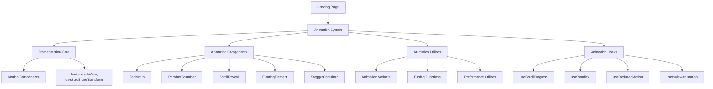

# Design Document: Landing Page Animations

## Overview

This design document specifies the technical implementation for enhancing the landing page with advanced animation effects using Framer Motion and parallax scrolling. The system will create a more engaging, dynamic user experience while maintaining all existing functionality and ensuring optimal performance across devices.

### Goals

- Implement smooth, performant animations using Framer Motion
- Create reusable animation components and utilities
- Add parallax scrolling effects for depth and visual interest
- Enhance user engagement through scroll-triggered animations
- Maintain 60fps performance on modern devices
- Preserve all existing landing page sections and functionality
- Support responsive behavior and reduced-motion preferences

### Non-Goals

- Redesigning the visual style or layout of existing sections
- Adding new landing page sections or content
- Implementing 3D animations or WebGL effects
- Supporting legacy browsers (IE11, older mobile browsers)

## Architecture

### High-Level Architecture



### Directory Structure

```
src/
├── components/
│   ├── landing/
│   │   ├── animations/
│   │   │   ├── FadeInUp.tsx
│   │   │   ├── ParallaxContainer.tsx
│   │   │   ├── ScrollReveal.tsx
│   │   │   ├── FloatingElement.tsx
│   │   │   ├── StaggerContainer.tsx
│   │   │   ├── ScrollProgressIndicator.tsx
│   │   │   ├── SVGPathDrawing.tsx (NEW)
│   │   │   ├── LetterSpacingText.tsx (NEW)
│   │   │   ├── BreathingElement.tsx (NEW)
│   │   │   ├── Card3DRotation.tsx (NEW)
│   │   │   ├── ParallaxImage.tsx (NEW)
│   │   │   ├── AmbientParticles.tsx (NEW)
│   │   │   └── index.ts
│   │   ├── VideoHeroSection.tsx (enhanced)
│   │   ├── FeatureSection.tsx (enhanced)
│   │   ├── IntroSection.tsx (enhanced)
│   │   ├── CatalogSection.tsx (enhanced)
│   │   ├── PricingSection.tsx (enhanced)
│   │   ├── OrderFormSection.tsx (enhanced)
│   │   └── FAQSection.tsx (enhanced)
│   └── ...
├── lib/
│   ├── animations/
│   │   ├── variants.ts
│   │   ├── easing.ts (ENHANCED with cubic bezier curves)
│   │   ├── performance.ts
│   │   └── index.ts
│   └── hooks/
│       ├── useScrollProgress.ts
│       ├── useParallax.ts
│       ├── useReducedMotion.ts
│       ├── useInViewAnimation.ts
│       ├── useScrollSectionTracking.ts (NEW)
│       └── index.ts
└── ...
```

## Components and Interfaces

### 1. FadeInUp Component

**Purpose**: Reusable component that fades in and slides up when entering viewport

**Interface**:
```typescript
interface FadeInUpProps {
  children: React.ReactNode
  delay?: number // Delay before animation starts (ms)
  duration?: number // Animation duration (ms)
  offset?: number // Initial Y offset (px)
  threshold?: number // Viewport intersection threshold (0-1)
  once?: boolean // Animate only once
  className?: string
}
```

**Implementation Strategy**:
- Use `useInView` hook from Framer Motion to detect viewport intersection
- Apply `initial`, `animate`, and `transition` props to motion.div
- Support customizable delay, duration, and offset
- Default threshold: 0.1 (10% visible)

### 2. ParallaxContainer Component

**Purpose**: Container that applies parallax scrolling effect to children

**Interface**:
```typescript
interface ParallaxContainerProps {
  children: React.ReactNode
  speed?: number // Parallax speed multiplier (0-1, default 0.5)
  direction?: 'up' | 'down' // Scroll direction
  className?: string
}
```

**Implementation Strategy**:
- Use `useScroll` and `useTransform` hooks from Framer Motion
- Calculate scroll progress relative to element position
- Transform Y position based on scroll progress and speed
- Use `transform3d` for GPU acceleration

### 3. ScrollReveal Component

**Purpose**: Generic scroll-triggered animation wrapper (already exists, will enhance)

**Interface**:
```typescript
interface ScrollRevealProps {
  children: React.ReactNode
  delay?: number
  variant?: 'fadeIn' | 'fadeInUp' | 'fadeInDown' | 'scaleIn' | 'slideInLeft' | 'slideInRight'
  threshold?: number
  once?: boolean
  className?: string
}
```

**Implementation Strategy**:
- Extend existing ScrollReveal component
- Support multiple animation variants from centralized config
- Use variant system for consistent animations

### 4. FloatingElement Component

**Purpose**: Applies continuous floating animation to decorative elements

**Interface**:
```typescript
interface FloatingElementProps {
  children: React.ReactNode
  duration?: number // Animation cycle duration (seconds)
  offset?: number // Maximum Y offset (px)
  delay?: number // Initial delay (seconds)
  className?: string
}
```

**Implementation Strategy**:
- Use `animate` prop with infinite repeat
- Apply `ease-in-out` easing for smooth motion
- Vary duration and offset for natural movement
- Use `transform: translateY` for performance

### 5. StaggerContainer Component

**Purpose**: Container that staggers animations of child elements

**Interface**:
```typescript
interface StaggerContainerProps {
  children: React.ReactNode
  staggerDelay?: number // Delay between child animations (ms)
  threshold?: number
  once?: boolean
  className?: string
}
```

**Implementation Strategy**:
- Use `staggerChildren` in parent variants
- Apply `delayChildren` for initial delay
- Children must be motion components to receive variants

### 6. ScrollProgressIndicator Component

**Purpose**: Visual indicator showing scroll progress through the page

**Interface**:
```typescript
interface ScrollProgressIndicatorProps {
  position?: 'top' | 'bottom' | 'left' | 'right'
  thickness?: number // Thickness in pixels
  color?: string
  className?: string
}
```

**Implementation Strategy**:
- Use `useScroll` hook with `scrollYProgress`
- Use `motion.div` with `scaleX` or `scaleY` based on position
- Fixed positioning for visibility during scroll
- Respect theme colors (light/dark mode)

### 7. SVGPathDrawing Component

**Purpose**: Animates SVG paths with drawing effect for decorative elements

**Interface**:
```typescript
interface SVGPathDrawingProps {
  path: string // SVG path data
  strokeColor?: string
  strokeWidth?: number
  duration?: number // Animation duration (seconds)
  delay?: number
  className?: string
}
```

**Implementation Strategy**:
- Use motion.path with pathLength animation from 0 to 1
- Apply cubic bezier easing [0.25, 0.1, 0.25, 1]
- Support ghost trail effect with multiple path layers
- Use strokeLinecap="round" and strokeLinejoin="round" for smooth appearance

### 8. LetterSpacingText Component

**Purpose**: Text component with animated letter spacing for premium typography

**Interface**:
```typescript
interface LetterSpacingTextProps {
  children: React.ReactNode
  initialSpacing?: string // Initial letter spacing (e.g., '0.8em')
  finalSpacing?: string // Final letter spacing (e.g., '0.35em')
  duration?: number
  delay?: number
  className?: string
}
```

**Implementation Strategy**:
- Use motion.span or motion.h1 with letterSpacing animation
- Combine with opacity animation for fade-in effect
- Use cubic bezier [0.22, 1, 0.36, 1] for smooth transition
- Support uppercase text with tracking-widest utility

### 9. BreathingElement Component

**Purpose**: Applies breathing animation to decorative elements

**Interface**:
```typescript
interface BreathingElementProps {
  children: React.ReactNode
  duration?: number // Breathing cycle duration (seconds, default 4)
  minOpacity?: number // Minimum opacity (default 0.2)
  maxOpacity?: number // Maximum opacity (default 0.6)
  minScale?: number // Minimum scale (default 1.0)
  maxScale?: number // Maximum scale (default 1.05)
  className?: string
}
```

**Implementation Strategy**:
- Use animate prop with infinite repeat and yoyo direction
- Synchronize opacity and scale animations
- Apply ease-in-out timing function
- Use CSS class for breathing animation as fallback

### 10. Card3DRotation Component

**Purpose**: 3D rotating card effect for product showcases

**Interface**:
```typescript
interface Card3DRotationProps {
  children: React.ReactNode
  rotationDuration?: number // Full rotation duration (seconds)
  perspective?: number // Perspective value (px, default 800)
  className?: string
}
```

**Implementation Strategy**:
- Use rotateY animation from 0 to 360 degrees with infinite repeat
- Apply rotateX animation for additional tilt effect
- Set perspective on parent container
- Use backfaceVisibility: hidden for clean transitions
- Support multiple card layers with different speeds

### 11. ParallaxImage Component

**Purpose**: Image with parallax scroll effect for depth

**Interface**:
```typescript
interface ParallaxImageProps {
  src: string
  alt: string
  speed?: number // Parallax speed (0.05-0.3, default 0.15)
  className?: string
}
```

**Implementation Strategy**:
- Use useScroll with target ref and offset ['start end', 'end start']
- Transform Y position based on scrollYProgress and speed
- Apply overflow: hidden to parent container
- Use height 130% with negative top positioning for parallax range

### 12. AmbientParticles Component

**Purpose**: Floating particle background effect

**Interface**:
```typescript
interface AmbientParticlesProps {
  count?: number // Number of particles (default 6-8)
  className?: string
}
```

**Implementation Strategy**:
- Generate particles with deterministic random positions (avoid hydration mismatch)
- Animate with y movement and opacity changes
- Use staggered delays for natural appearance
- Apply pointer-events: none to prevent interaction
- Keep opacity low (0.08-0.2) for subtle effect

**Purpose**: Visual indicator showing scroll progress through the page

**Interface**:
```typescript
interface ScrollProgressIndicatorProps {
  position?: 'top' | 'bottom' | 'left' | 'right'
  thickness?: number // Thickness in pixels
  color?: string
  className?: string
}
```

**Implementation Strategy**:
- Use `useScroll` hook with `scrollYProgress`
- Use `motion.div` with `scaleX` or `scaleY` based on position
- Fixed positioning for visibility during scroll
- Respect theme colors (light/dark mode)

## Data Models

### Animation Variant Configuration

```typescript
// src/lib/animations/variants.ts

export interface AnimationVariant {
  initial: MotionProps['initial']
  animate: MotionProps['animate']
  exit?: MotionProps['exit']
  transition?: MotionProps['transition']
}

export interface AnimationVariants {
  fadeIn: AnimationVariant
  fadeInUp: AnimationVariant
  fadeInDown: AnimationVariant
  fadeInLeft: AnimationVariant
  fadeInRight: AnimationVariant
  scaleIn: AnimationVariant
  slideInLeft: AnimationVariant
  slideInRight: AnimationVariant
  floatingSubtle: AnimationVariant
  floatingMedium: AnimationVariant
  floatingStrong: AnimationVariant
}
```

### Parallax Configuration

```typescript
// src/lib/animations/parallax.ts

export interface ParallaxConfig {
  speed: number // 0-1, where 0.5 is half scroll speed
  direction: 'up' | 'down'
  startOffset?: number
  endOffset?: number
}

export interface ParallaxPresets {
  slow: ParallaxConfig
  medium: ParallaxConfig
  fast: ParallaxConfig
}
```

### Performance Configuration

```typescript
// src/lib/animations/performance.ts

export interface PerformanceConfig {
  enableGPUAcceleration: boolean
  useWillChange: boolean
  reducedMotion: boolean
  maxConcurrentAnimations?: number
}
```

### Cubic Bezier Easing Configuration

```typescript
// src/lib/animations/easing.ts (ENHANCED)

export interface CubicBezierEasing {
  name: string
  curve: [number, number, number, number]
  description: string
  useCase: string
}

export interface EasingPresets {
  smoothEaseOut: CubicBezierEasing // [0.22, 1, 0.36, 1] - entrance animations
  smoothEaseInOut: CubicBezierEasing // [0.25, 0.1, 0.25, 1] - SVG drawing, complex animations
  springBounce: CubicBezierEasing // [0.68, -0.55, 0.265, 1.55] - playful interactions
}

export interface SpringPhysicsConfig {
  type: 'spring'
  stiffness: number // 350 for responsive, 200 for smooth
  damping: number // 25 for responsive, 30 for smooth
  mass?: number // Optional, default 1
}
```

### SVG Path Drawing Configuration

```typescript
// src/lib/animations/svgPaths.ts (NEW)

export interface SVGPathConfig {
  path: string
  strokeColor: string
  strokeWidth: number
  duration: number
  easing: [number, number, number, number]
}

export interface SVGPathLibrary {
  rose: SVGPathConfig
  leaf1: SVGPathConfig
  leaf2: SVGPathConfig
  ornament: SVGPathConfig
}
```

### Scroll Section Tracking Configuration

```typescript
// src/lib/hooks/useScrollSectionTracking.ts (NEW)

export interface ScrollSection {
  id: string
  threshold: number // Scroll progress threshold (0-1)
}

export interface ScrollSectionConfig {
  sections: ScrollSection[]
  onSectionChange?: (sectionId: string) => void
}
```

## Correctness Properties

*A property is a characteristic or behavior that should hold true across all valid executions of a system—essentially, a formal statement about what the system should do. Properties serve as the bridge between human-readable specifications and machine-verifiable correctness guarantees.*

However, for this feature (landing page animations), **property-based testing is NOT appropriate**. Here's why:

### Why PBT Does Not Apply

1. **UI Rendering and Animation**: The feature primarily involves UI rendering, CSS transforms, and visual animations. These are not pure functions with clear input/output behavior that can be universally quantified.

2. **Side-Effect Operations**: Animations are side-effect operations that manipulate the DOM and trigger browser repaints. There's no return value to assert universal properties on.

3. **Visual and Timing-Based**: The correctness of animations depends on visual appearance, timing, and user perception—qualities that cannot be captured in automated property tests.

4. **Browser-Dependent Behavior**: Animation performance and rendering vary across browsers and devices, making universal properties impractical.

### Alternative Testing Strategies

Instead of property-based testing, this feature will use:

- **Snapshot Tests**: Verify that animation components render with correct initial props and structure
- **Unit Tests**: Test animation utility functions (easing calculations, scroll progress calculations)
- **Integration Tests**: Verify that animations trigger correctly on scroll/viewport intersection
- **Visual Regression Tests**: Capture screenshots at different animation states (optional, if tooling available)
- **Performance Tests**: Measure frame rates and animation smoothness using browser performance APIs
- **Manual QA**: Test animations across different devices, browsers, and screen sizes

## Error Handling

### Animation Failures

**Scenario**: Framer Motion fails to initialize or animation throws error

**Handling**:
- Wrap animation components in error boundaries
- Fallback to static rendering without animations
- Log errors to console in development mode
- Gracefully degrade to CSS-only animations if possible

```typescript
// Example error boundary for animations
class AnimationErrorBoundary extends React.Component {
  componentDidCatch(error: Error) {
    console.error('Animation error:', error)
    // Fallback to children without animation
  }
  
  render() {
    return this.props.children
  }
}
```

### Performance Degradation

**Scenario**: Animations cause frame drops or poor performance

**Handling**:
- Detect frame rate using `requestAnimationFrame`
- Automatically reduce animation complexity if FPS < 30
- Disable parallax effects on low-end devices
- Respect `prefers-reduced-motion` media query

```typescript
// Performance monitoring
const usePerformanceMonitor = () => {
  const [fps, setFps] = useState(60)
  
  useEffect(() => {
    let frameCount = 0
    let lastTime = performance.now()
    
    const measureFPS = () => {
      frameCount++
      const currentTime = performance.now()
      
      if (currentTime >= lastTime + 1000) {
        setFps(frameCount)
        frameCount = 0
        lastTime = currentTime
      }
      
      requestAnimationFrame(measureFPS)
    }
    
    measureFPS()
  }, [])
  
  return fps
}
```

### Reduced Motion Preference

**Scenario**: User has enabled reduced motion in system preferences

**Handling**:
- Detect `prefers-reduced-motion: reduce` media query
- Disable or simplify animations
- Maintain functionality without animations
- Provide instant transitions instead of animated ones

```typescript
// Hook to detect reduced motion preference
const useReducedMotion = () => {
  const [prefersReducedMotion, setPrefersReducedMotion] = useState(false)
  
  useEffect(() => {
    const mediaQuery = window.matchMedia('(prefers-reduced-motion: reduce)')
    setPrefersReducedMotion(mediaQuery.matches)
    
    const handler = (e: MediaQueryListEvent) => {
      setPrefersReducedMotion(e.matches)
    }
    
    mediaQuery.addEventListener('change', handler)
    return () => mediaQuery.removeEventListener('change', handler)
  }, [])
  
  return prefersReducedMotion
}
```

### Mobile Performance

**Scenario**: Animations perform poorly on mobile devices

**Handling**:
- Detect mobile devices using user agent or screen size
- Reduce parallax intensity by 50% on mobile
- Disable complex animations on devices with < 4GB RAM (if detectable)
- Use simpler fade/slide animations instead of complex transforms

```typescript
// Mobile detection and optimization
const useIsMobile = () => {
  const [isMobile, setIsMobile] = useState(false)
  
  useEffect(() => {
    const checkMobile = () => {
      setIsMobile(window.innerWidth < 768)
    }
    
    checkMobile()
    window.addEventListener('resize', checkMobile)
    return () => window.removeEventListener('resize', checkMobile)
  }, [])
  
  return isMobile
}
```

### Scroll Event Throttling

**Scenario**: Excessive scroll events cause performance issues

**Handling**:
- Throttle scroll event handlers to max 60fps (16.67ms intervals)
- Use `requestAnimationFrame` for scroll-based animations
- Debounce expensive calculations
- Use Framer Motion's built-in optimization

```typescript
// Throttled scroll handler
const useThrottledScroll = (callback: () => void, delay: number = 16) => {
  const lastRun = useRef(Date.now())
  
  useEffect(() => {
    const handleScroll = () => {
      const now = Date.now()
      if (now - lastRun.current >= delay) {
        callback()
        lastRun.current = now
      }
    }
    
    window.addEventListener('scroll', handleScroll, { passive: true })
    return () => window.removeEventListener('scroll', handleScroll)
  }, [callback, delay])
}
```

## Testing Strategy

### Unit Tests

**Scope**: Test individual animation utilities and helper functions

**Test Cases**:
1. Animation variant configurations return correct motion props
2. Easing functions calculate correct values for given inputs
3. Scroll progress calculations return values between 0-1
4. Parallax offset calculations produce correct transform values
5. Reduced motion hook correctly detects media query changes
6. Performance utilities correctly identify low-end devices

**Tools**: Jest, React Testing Library

**Example**:
```typescript
describe('Animation Variants', () => {
  it('fadeInUp variant has correct initial and animate states', () => {
    const variant = animationVariants.fadeInUp
    expect(variant.initial).toEqual({ opacity: 0, y: 30 })
    expect(variant.animate).toEqual({ opacity: 1, y: 0 })
  })
  
  it('fadeInUp transition has correct duration', () => {
    const variant = animationVariants.fadeInUp
    expect(variant.transition?.duration).toBe(0.6)
  })
})
```

### Component Tests

**Scope**: Test animation components render correctly and accept props

**Test Cases**:
1. FadeInUp component renders children correctly
2. FadeInUp accepts and applies custom delay prop
3. ParallaxContainer applies correct transform based on scroll
4. ScrollReveal triggers animation when threshold is met
5. FloatingElement applies continuous animation
6. StaggerContainer staggers child animations correctly
7. ScrollProgressIndicator updates based on scroll position

**Tools**: Jest, React Testing Library, @testing-library/user-event

**Example**:
```typescript
describe('FadeInUp Component', () => {
  it('renders children correctly', () => {
    render(<FadeInUp><div>Test Content</div></FadeInUp>)
    expect(screen.getByText('Test Content')).toBeInTheDocument()
  })
  
  it('applies custom delay prop', () => {
    const { container } = render(
      <FadeInUp delay={500}><div>Test</div></FadeInUp>
    )
    const motionDiv = container.firstChild
    // Check that delay is applied to transition
    expect(motionDiv).toHaveStyle({ /* check computed styles */ })
  })
})
```

### Integration Tests

**Scope**: Test animations work correctly within landing page sections

**Test Cases**:
1. Hero section animations trigger on page load
2. Feature cards animate when scrolled into view
3. Parallax elements move at different speeds during scroll
4. Hover animations apply correctly to interactive elements
5. Scroll progress indicator updates during scroll
6. Stagger animations sequence correctly in feature grid
7. Animations respect reduced motion preference

**Tools**: Jest, React Testing Library, Mock Intersection Observer

**Example**:
```typescript
describe('Feature Section Animations', () => {
  it('animates feature cards when scrolled into view', () => {
    const { container } = render(<FeatureSection />)
    
    // Mock IntersectionObserver
    const mockIntersectionObserver = jest.fn()
    mockIntersectionObserver.mockReturnValue({
      observe: () => null,
      unobserve: () => null,
      disconnect: () => null
    })
    window.IntersectionObserver = mockIntersectionObserver
    
    // Trigger intersection
    const [{ callback }] = mockIntersectionObserver.mock.calls[0]
    callback([{ isIntersecting: true }])
    
    // Check that animation classes are applied
    expect(container.querySelector('.feature-card')).toHaveClass('animate')
  })
})
```

### Performance Tests

**Scope**: Verify animations maintain acceptable performance

**Test Cases**:
1. Animations maintain 60fps on desktop (measure with Performance API)
2. Animations maintain 30fps minimum on mobile
3. Scroll events are throttled to prevent excessive calls
4. GPU acceleration is applied to animated elements (check computed styles)
5. will-change property is applied correctly
6. No layout thrashing during animations (measure reflows)

**Tools**: Jest, Puppeteer (for browser performance testing)

**Example**:
```typescript
describe('Animation Performance', () => {
  it('maintains 60fps during scroll animations', async () => {
    const page = await browser.newPage()
    await page.goto('http://localhost:3000')
    
    // Start performance monitoring
    await page.evaluate(() => {
      window.frameRates = []
      let lastTime = performance.now()
      
      const measureFrame = () => {
        const currentTime = performance.now()
        const fps = 1000 / (currentTime - lastTime)
        window.frameRates.push(fps)
        lastTime = currentTime
        
        if (window.frameRates.length < 60) {
          requestAnimationFrame(measureFrame)
        }
      }
      
      requestAnimationFrame(measureFrame)
    })
    
    // Scroll the page
    await page.evaluate(() => window.scrollBy(0, 1000))
    
    // Wait for measurements
    await page.waitForTimeout(1000)
    
    // Check average FPS
    const avgFps = await page.evaluate(() => {
      const sum = window.frameRates.reduce((a, b) => a + b, 0)
      return sum / window.frameRates.length
    })
    
    expect(avgFps).toBeGreaterThanOrEqual(55) // Allow some variance
  })
})
```

### Visual Regression Tests (Optional)

**Scope**: Capture screenshots of animations at different states

**Test Cases**:
1. Hero section initial state (before animation)
2. Hero section animated state (after animation)
3. Feature cards in viewport (animated)
4. Parallax elements at different scroll positions
5. Hover states on interactive elements

**Tools**: Playwright, Percy, or Chromatic

**Note**: Visual regression testing is optional and depends on available tooling and budget.

### Manual QA Checklist

**Scope**: Manual testing across devices and browsers

**Test Cases**:
1. Test on Chrome, Firefox, Safari, Edge (latest versions)
2. Test on iOS Safari and Android Chrome
3. Test on different screen sizes (mobile, tablet, desktop)
4. Test with reduced motion enabled in system preferences
5. Test scroll performance with DevTools Performance panel
6. Verify animations feel smooth and natural
7. Check that no animations are broken or glitchy
8. Verify all existing sections remain intact
9. Test theme switching (light/dark mode) with animations
10. Test on slow network connections (animations should still work)

### Test Coverage Goals

- **Unit Tests**: 80%+ coverage of animation utilities and helpers
- **Component Tests**: 70%+ coverage of animation components
- **Integration Tests**: Cover all major landing page sections with animations
- **Performance Tests**: Verify 60fps on desktop, 30fps on mobile
- **Manual QA**: Test on at least 3 browsers and 2 mobile devices

### Continuous Integration

- Run unit and component tests on every commit
- Run integration tests on pull requests
- Run performance tests weekly or before releases
- Manual QA before production deployment

## Implementation Plan

### Phase 1: Foundation (Week 1)

1. Create animation utilities and variants configuration
2. Implement core animation hooks (useReducedMotion, useScrollProgress)
3. Create base animation components (FadeInUp, ScrollReveal enhancement)
4. Set up error boundaries for animations
5. Write unit tests for utilities and hooks

### Phase 2: Core Animations (Week 2)

1. Implement ParallaxContainer component
2. Implement FloatingElement component
3. Implement StaggerContainer component
4. Implement ScrollProgressIndicator component
5. Write component tests for all new components

### Phase 3: Section Integration (Week 3)

1. Enhance VideoHeroSection with improved animations
2. Enhance FeatureSection with stagger animations
3. Add parallax effects to IntroSection
4. Add scroll-triggered animations to CatalogSection
5. Add animations to PricingSection and OrderFormSection
6. Write integration tests for enhanced sections

### Phase 4: Polish and Optimization (Week 4)

1. Implement performance monitoring and optimization
2. Add mobile-specific optimizations
3. Fix any animation bugs or glitches
4. Ensure reduced motion support works correctly
5. Run performance tests and optimize as needed
6. Complete manual QA across devices and browsers

### Phase 5: Documentation and Deployment

1. Document all animation components and utilities
2. Create usage examples for developers
3. Update README with animation guidelines
4. Deploy to staging for final testing
5. Deploy to production

## Performance Optimization Strategies

### 1. GPU Acceleration

- Use `transform` and `opacity` properties (GPU-accelerated)
- Avoid animating `width`, `height`, `top`, `left` (CPU-bound)
- Apply `transform: translate3d(0, 0, 0)` to force GPU layer
- Use `will-change` property sparingly (only during animation)

```typescript
// Optimized animation
const optimizedVariant = {
  initial: { opacity: 0, transform: 'translate3d(0, 30px, 0)' },
  animate: { opacity: 1, transform: 'translate3d(0, 0, 0)' }
}
```

### 2. Scroll Event Optimization

- Use `passive: true` for scroll event listeners
- Throttle scroll handlers to 60fps (16.67ms)
- Use `requestAnimationFrame` for scroll-based animations
- Leverage Framer Motion's built-in scroll optimization

```typescript
// Optimized scroll listener
useEffect(() => {
  const handleScroll = () => {
    requestAnimationFrame(() => {
      // Animation logic here
    })
  }
  
  window.addEventListener('scroll', handleScroll, { passive: true })
  return () => window.removeEventListener('scroll', handleScroll)
}, [])
```

### 3. Intersection Observer

- Use Intersection Observer for viewport detection (more efficient than scroll events)
- Set appropriate threshold values (0.1 = 10% visible)
- Use `rootMargin` to trigger animations slightly before element enters viewport
- Disconnect observers when no longer needed

```typescript
// Efficient viewport detection
const { ref, inView } = useInView({
  threshold: 0.1,
  triggerOnce: true, // Animate only once
  rootMargin: '50px' // Trigger 50px before entering viewport
})
```

### 4. Animation Complexity Reduction

- Reduce parallax intensity on mobile (50% of desktop)
- Disable complex animations on low-end devices
- Use simpler animations when reduced motion is preferred
- Limit number of concurrent animations

```typescript
// Adaptive animation complexity
const isMobile = useIsMobile()
const prefersReducedMotion = useReducedMotion()

const parallaxSpeed = prefersReducedMotion ? 0 : isMobile ? 0.25 : 0.5
```

### 5. Code Splitting

- Lazy load animation components when needed
- Use dynamic imports for heavy animation utilities
- Split animation code from critical rendering path

```typescript
// Lazy load animation components
const ParallaxContainer = lazy(() => import('./animations/ParallaxContainer'))
```

### 6. Memoization

- Memoize expensive animation calculations
- Use `useMemo` for variant configurations
- Use `useCallback` for animation handlers

```typescript
// Memoized animation variant
const fadeInUpVariant = useMemo(() => ({
  initial: { opacity: 0, y: offset },
  animate: { opacity: 1, y: 0 },
  transition: { duration, delay }
}), [offset, duration, delay])
```

## Responsive Design Considerations

### Desktop (≥1024px)

- Full animation complexity
- Parallax effects at 100% intensity
- All hover animations enabled
- 60fps target

### Tablet (768px - 1023px)

- Full animation complexity
- Parallax effects at 75% intensity
- All hover animations enabled
- 60fps target

### Mobile (< 768px)

- Reduced animation complexity
- Parallax effects at 50% intensity
- Simplified hover animations (tap-based)
- 30fps minimum target
- Disable resource-intensive animations

### Reduced Motion

- Disable all parallax effects
- Use instant transitions instead of animations
- Maintain functionality without animations
- Respect user preference

## Browser Compatibility

### Supported Browsers

- Chrome/Edge 90+ (Chromium-based)
- Firefox 88+
- Safari 14+
- iOS Safari 14+
- Android Chrome 90+

### Fallbacks

- Graceful degradation for older browsers
- CSS-only animations as fallback
- Static rendering if JavaScript fails
- No broken functionality in unsupported browsers

## Accessibility Considerations

### Reduced Motion

- Respect `prefers-reduced-motion: reduce` media query
- Provide instant transitions for users who prefer reduced motion
- Maintain all functionality without animations

### Keyboard Navigation

- Ensure animated elements are keyboard accessible
- Focus states work correctly with animations
- Tab order is not affected by animations

### Screen Readers

- Animations do not interfere with screen reader announcements
- Use `aria-live` regions appropriately
- Ensure content is accessible regardless of animation state

## Deployment Considerations

### Build Optimization

- Ensure Framer Motion is properly tree-shaken
- Minimize bundle size by importing only needed components
- Use production build for optimal performance

### Monitoring

- Monitor animation performance in production
- Track frame rates and animation smoothness
- Log animation errors to error tracking service
- Monitor user feedback on animation experience

### Rollback Plan

- Feature flag for animations (can disable if issues arise)
- Gradual rollout to percentage of users
- Quick rollback capability if performance issues detected

---

## Summary

This design provides a comprehensive architecture for implementing advanced animations on the landing page using Framer Motion. The system prioritizes performance, accessibility, and maintainability while creating an engaging user experience. All existing sections will be preserved, and animations will gracefully degrade on low-end devices or when users prefer reduced motion.

The implementation will follow a phased approach, starting with foundational utilities and components, then integrating animations into existing sections, and finally optimizing for performance and accessibility. Testing will cover unit, component, integration, and performance aspects to ensure a high-quality implementation.
