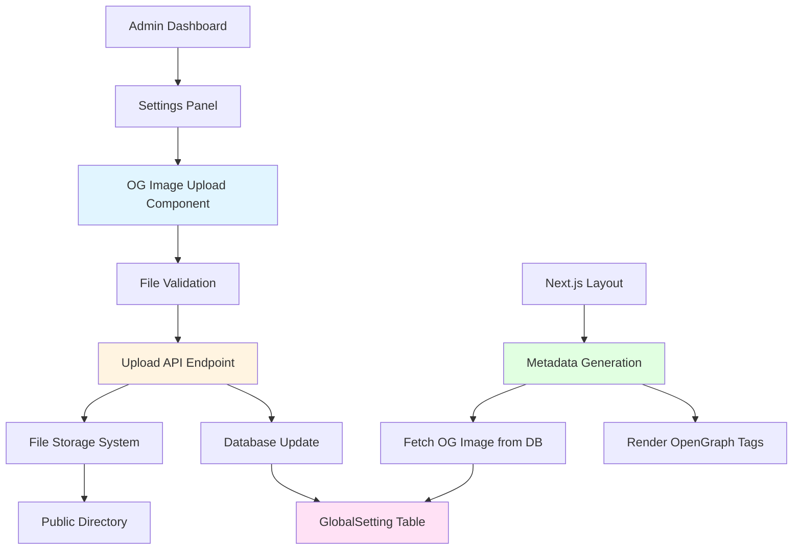
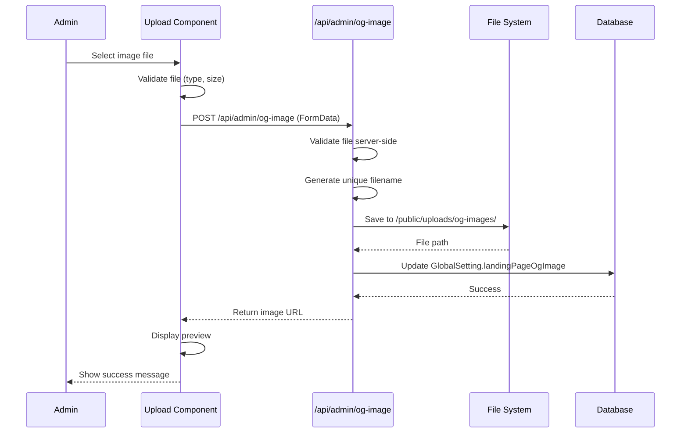
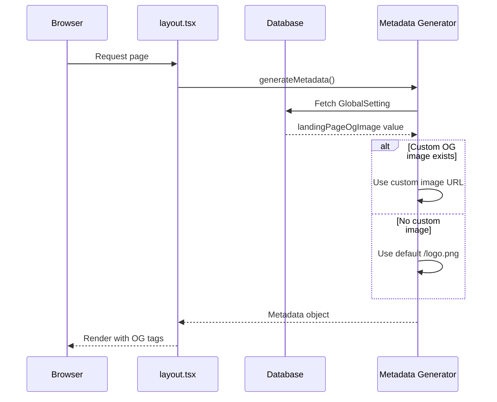

# Design Document: Open Graph Image Upload for Landing Page Settings

## Overview

This feature adds the ability for administrators to upload custom Open Graph (OG) images for the landing page through the admin settings panel. Currently, the OG image is hardcoded to `/logo.png` in the application layout. This enhancement allows admins to upload their own OG images from local disk, which will be displayed when the landing page is shared on social media platforms (Facebook, Twitter, LinkedIn, WhatsApp, etc.).

The feature is independent of landing page theme selection, meaning the custom OG image will be used regardless of which theme is active. The system will support common image formats (PNG, JPG, WEBP) with recommended dimensions of 1200x630px for optimal social media display.

## Architecture



## Sequence Diagrams

### Upload Flow



### Metadata Rendering Flow



## Components and Interfaces

### Component 1: OGImageUploader

**Purpose**: React component for uploading and managing OG images in the admin settings panel

**Interface**:
```typescript
interface OGImageUploaderProps {
  currentImageUrl?: string | null
  onUploadSuccess?: (imageUrl: string) => void
  onUploadError?: (error: string) => void
}

interface OGImageUploadResponse {
  success: boolean
  data?: {
    imageUrl: string
    fileName: string
  }
  error?: string
}
```

**Responsibilities**:
- Display current OG image preview
- Handle file selection (drag-and-drop or file input)
- Validate file type and size on client-side
- Upload file to API endpoint
- Display upload progress
- Show success/error messages
- Allow image deletion/replacement

### Component 2: ImagePreview

**Purpose**: Display preview of uploaded OG image with metadata

**Interface**:
```typescript
interface ImagePreviewProps {
  imageUrl: string
  alt: string
  onDelete?: () => void
  showMetadata?: boolean
}
```

**Responsibilities**:
- Display image with proper aspect ratio
- Show image dimensions and file size
- Provide delete/replace action button
- Display recommended dimensions hint

### Component 3: FileValidator

**Purpose**: Utility for validating image files

**Interface**:
```typescript
interface ValidationResult {
  valid: boolean
  error?: string
}

interface FileValidatorConfig {
  maxSizeBytes: number
  allowedTypes: string[]
  recommendedWidth: number
  recommendedHeight: number
}

function validateImageFile(
  file: File,
  config: FileValidatorConfig
): Promise<ValidationResult>
```

**Responsibilities**:
- Check file type (MIME type)
- Validate file size
- Check image dimensions
- Return validation errors

## Data Models

### Model 1: GlobalSetting (Updated)

```typescript
interface GlobalSetting {
  id: string                    // Primary key, default "global"
  landingPageTheme: string      // Existing field
  landingPageFavicon: string?   // Existing field
  landingPageOgImage: string?   // NEW: Path to uploaded OG image
  updatedAt: DateTime
}
```

**Validation Rules**:
- `landingPageOgImage` must be a valid file path or URL
- Must start with `/uploads/og-images/` for uploaded files
- Optional field (null means use default)

### Model 2: UploadedFile

```typescript
interface UploadedFile {
  originalName: string
  fileName: string
  filePath: string
  fileSize: number
  mimeType: string
  uploadedAt: Date
}
```

**Validation Rules**:
- `mimeType` must be one of: image/png, image/jpeg, image/webp
- `fileSize` must be ≤ 5MB (5,242,880 bytes)
- `fileName` must be unique

## Key Functions with Formal Specifications

### Function 1: uploadOGImage()

```typescript
async function uploadOGImage(
  formData: FormData
): Promise<OGImageUploadResponse>
```

**Preconditions:**
- `formData` contains a file field named "image"
- File is a valid image (PNG, JPG, WEBP)
- File size ≤ 5MB
- User is authenticated as admin

**Postconditions:**
- File is saved to `/public/uploads/og-images/` with unique name
- Database `GlobalSetting.landingPageOgImage` is updated
- Returns success response with image URL
- If error occurs, no file is saved and database is unchanged

**Loop Invariants:** N/A (no loops in main logic)

### Function 2: validateImageFile()

```typescript
async function validateImageFile(
  file: File
): Promise<ValidationResult>
```

**Preconditions:**
- `file` is a File object from browser
- `file` is not null or undefined

**Postconditions:**
- Returns `{ valid: true }` if all checks pass
- Returns `{ valid: false, error: string }` if any check fails
- No side effects (pure validation)

**Loop Invariants:** N/A

### Function 3: deleteOGImage()

```typescript
async function deleteOGImage(): Promise<{ success: boolean }>
```

**Preconditions:**
- User is authenticated as admin
- `GlobalSetting.landingPageOgImage` exists in database

**Postconditions:**
- File is deleted from file system (if exists)
- `GlobalSetting.landingPageOgImage` is set to null
- Returns success status
- If file doesn't exist, only database is updated (no error)

**Loop Invariants:** N/A

### Function 4: getOGImageForMetadata()

```typescript
async function getOGImageForMetadata(): Promise<string>
```

**Preconditions:**
- Function is called during metadata generation
- Database connection is available

**Postconditions:**
- Returns custom OG image URL if exists in database
- Returns default `/logo.png` if no custom image
- Never returns null or undefined (always has fallback)

**Loop Invariants:** N/A

## Algorithmic Pseudocode

### Main Upload Algorithm

```pascal
ALGORITHM uploadOGImageWorkflow(formData)
INPUT: formData containing image file
OUTPUT: result of type OGImageUploadResponse

BEGIN
  // Step 1: Extract and validate file
  file ← formData.get("image")
  
  IF file IS NULL THEN
    RETURN Error("No file provided")
  END IF
  
  validation ← validateImageFile(file)
  
  IF NOT validation.valid THEN
    RETURN Error(validation.error)
  END IF
  
  // Step 2: Generate unique filename
  timestamp ← getCurrentTimestamp()
  randomId ← generateUUID()
  extension ← getFileExtension(file.name)
  uniqueFileName ← concatenate("og-", timestamp, "-", randomId, extension)
  
  // Step 3: Save file to disk
  uploadPath ← "/public/uploads/og-images/"
  fullPath ← concatenate(uploadPath, uniqueFileName)
  
  TRY
    saveFileToDisk(file, fullPath)
  CATCH error
    RETURN Error("Failed to save file: " + error.message)
  END TRY
  
  // Step 4: Update database
  publicUrl ← concatenate("/uploads/og-images/", uniqueFileName)
  
  TRY
    updateGlobalSetting("landingPageOgImage", publicUrl)
  CATCH error
    // Rollback: delete uploaded file
    deleteFile(fullPath)
    RETURN Error("Failed to update database: " + error.message)
  END TRY
  
  // Step 5: Return success
  RETURN Success({
    imageUrl: publicUrl,
    fileName: uniqueFileName
  })
END
```

**Preconditions:**
- formData is valid FormData object
- Upload directory exists and is writable
- Database connection is active

**Postconditions:**
- File is saved OR error is returned with no side effects
- Database is updated OR file is rolled back
- Transaction is atomic (both file and DB succeed or both fail)

**Loop Invariants:** N/A

### Validation Algorithm

```pascal
ALGORITHM validateImageFile(file)
INPUT: file of type File
OUTPUT: validation result

BEGIN
  // Check 1: File type validation
  allowedTypes ← ["image/png", "image/jpeg", "image/webp"]
  
  IF file.type NOT IN allowedTypes THEN
    RETURN { valid: false, error: "Invalid file type. Only PNG, JPG, WEBP allowed" }
  END IF
  
  // Check 2: File size validation
  maxSize ← 5242880  // 5MB in bytes
  
  IF file.size > maxSize THEN
    RETURN { valid: false, error: "File too large. Maximum size is 5MB" }
  END IF
  
  // Check 3: Image dimensions (optional warning)
  dimensions ← getImageDimensions(file)
  recommendedWidth ← 1200
  recommendedHeight ← 630
  
  IF dimensions.width < recommendedWidth OR dimensions.height < recommendedHeight THEN
    // Note: This is a warning, not a blocking error
    logWarning("Image dimensions below recommended size")
  END IF
  
  // All validations passed
  RETURN { valid: true }
END
```

**Preconditions:**
- file is a valid File object
- file.type and file.size properties are accessible

**Postconditions:**
- Returns validation result with clear error message if invalid
- Returns success if all checks pass
- No mutations to input file

**Loop Invariants:** N/A

### Metadata Generation Algorithm

```pascal
ALGORITHM generateMetadataWithOGImage()
INPUT: None (reads from database)
OUTPUT: metadata object with OG image

BEGIN
  // Step 1: Fetch global settings
  globalSetting ← database.findUnique("GlobalSetting", { id: "global" })
  
  // Step 2: Determine OG image URL
  IF globalSetting IS NOT NULL AND globalSetting.landingPageOgImage IS NOT NULL THEN
    ogImageUrl ← globalSetting.landingPageOgImage
  ELSE
    ogImageUrl ← "/logo.png"  // Default fallback
  END IF
  
  // Step 3: Build metadata object
  metadata ← {
    title: "Katalog Undanganku - Platform Undangan Pernikahan Digital",
    description: "Buat undangan pernikahan digital yang elegan...",
    openGraph: {
      title: "Katalog Undanganku - Undangan Pernikahan Digital",
      description: "Buat undangan pernikahan digital...",
      images: [
        {
          url: ogImageUrl,
          width: 1200,
          height: 630,
          alt: "Katalog Undanganku - Undangan Pernikahan Digital"
        }
      ]
    },
    twitter: {
      card: "summary_large_image",
      images: [ogImageUrl]
    }
  }
  
  RETURN metadata
END
```

**Preconditions:**
- Database connection is available
- Function is called during server-side rendering

**Postconditions:**
- Always returns valid metadata object
- OG image is never null (uses fallback)
- Metadata structure matches Next.js Metadata type

**Loop Invariants:** N/A

## Example Usage

### Example 1: Upload OG Image from Admin Panel

```typescript
// In admin settings component
const handleFileSelect = async (file: File) => {
  // Client-side validation
  const validation = await validateImageFile(file)
  
  if (!validation.valid) {
    toast.error(validation.error)
    return
  }
  
  // Prepare form data
  const formData = new FormData()
  formData.append('image', file)
  
  // Upload to API
  try {
    const response = await fetch('/api/admin/og-image', {
      method: 'POST',
      body: formData
    })
    
    const result = await response.json()
    
    if (result.success) {
      toast.success('OG image uploaded successfully')
      setCurrentOgImage(result.data.imageUrl)
    } else {
      toast.error(result.error)
    }
  } catch (error) {
    toast.error('Failed to upload image')
  }
}
```

### Example 2: Delete OG Image

```typescript
const handleDeleteOgImage = async () => {
  try {
    const response = await fetch('/api/admin/og-image', {
      method: 'DELETE'
    })
    
    const result = await response.json()
    
    if (result.success) {
      toast.success('OG image removed. Using default logo.')
      setCurrentOgImage(null)
    }
  } catch (error) {
    toast.error('Failed to delete image')
  }
}
```

### Example 3: Metadata Generation in layout.tsx

```typescript
// In src/app/layout.tsx
export async function generateMetadata(): Promise<Metadata> {
  // Fetch OG image from database
  const ogImageUrl = await getOGImageForMetadata()
  
  return {
    metadataBase: new URL('https://katalog-id.vercel.app'),
    title: "Katalog Undanganku - Platform Undangan Pernikahan Digital",
    // ... other metadata
    openGraph: {
      images: [
        {
          url: ogImageUrl, // Dynamic OG image
          width: 1200,
          height: 630,
          alt: "Katalog Undanganku"
        }
      ]
    },
    twitter: {
      card: "summary_large_image",
      images: [ogImageUrl]
    }
  }
}
```

## Correctness Properties

### Property 1: Upload Atomicity
**Statement**: ∀ upload operations, either both file storage AND database update succeed, OR neither succeeds (atomic transaction)

**Verification**: If database update fails, uploaded file must be deleted (rollback)

### Property 2: File Type Safety
**Statement**: ∀ uploaded files, file.mimeType ∈ {image/png, image/jpeg, image/webp}

**Verification**: Server-side validation must reject any file with invalid MIME type

### Property 3: Metadata Fallback Guarantee
**Statement**: ∀ metadata generation calls, OG image URL is never null or undefined

**Verification**: If custom image is null, default `/logo.png` is used

### Property 4: Unique Filename Generation
**Statement**: ∀ uploaded files, filename is unique (no collisions)

**Verification**: Filename includes timestamp + UUID, ensuring uniqueness

### Property 5: File Size Constraint
**Statement**: ∀ uploaded files, file.size ≤ 5,242,880 bytes (5MB)

**Verification**: Both client and server validation enforce size limit

### Property 6: Path Security
**Statement**: ∀ file operations, file path must be within `/public/uploads/og-images/` directory

**Verification**: Path traversal attacks prevented by validating and sanitizing file paths

## Error Handling

### Error Scenario 1: Invalid File Type

**Condition**: User uploads a file that is not PNG, JPG, or WEBP
**Response**: 
- Client-side: Show error toast "Invalid file type. Only PNG, JPG, WEBP allowed"
- Server-side: Return 400 Bad Request with error message
**Recovery**: User can select a different file

### Error Scenario 2: File Too Large

**Condition**: User uploads a file larger than 5MB
**Response**:
- Client-side: Show error toast "File too large. Maximum size is 5MB"
- Server-side: Return 400 Bad Request with error message
**Recovery**: User must resize or compress image before uploading

### Error Scenario 3: File System Write Failure

**Condition**: Server cannot write file to disk (permissions, disk full, etc.)
**Response**:
- Server logs error details
- Return 500 Internal Server Error
- Show generic error to user: "Failed to save file. Please try again."
**Recovery**: Admin should check server logs and fix file system issues

### Error Scenario 4: Database Update Failure

**Condition**: File uploaded successfully but database update fails
**Response**:
- Delete uploaded file (rollback)
- Return 500 Internal Server Error
- Show error: "Failed to update settings. Please try again."
**Recovery**: User can retry upload; no orphaned files left on disk

### Error Scenario 5: Missing File in Request

**Condition**: API endpoint called without file in FormData
**Response**:
- Return 400 Bad Request with error "No file provided"
**Recovery**: Client should ensure file is included in FormData

### Error Scenario 6: Unauthorized Access

**Condition**: Non-admin user attempts to upload OG image
**Response**:
- Return 401 Unauthorized or 403 Forbidden
- Show error: "You don't have permission to perform this action"
**Recovery**: User must log in as admin

## Testing Strategy

### Unit Testing Approach

**Test Coverage Goals**: 80%+ code coverage for all utility functions and API handlers

**Key Test Cases**:

1. **File Validation Tests**
   - Valid PNG file passes validation
   - Valid JPG file passes validation
   - Valid WEBP file passes validation
   - Invalid file type (PDF, GIF) fails validation
   - File exceeding 5MB fails validation
   - File with exactly 5MB passes validation
   - Null file fails validation

2. **Upload API Tests**
   - Successful upload returns correct response structure
   - Upload with invalid file type returns 400
   - Upload with oversized file returns 400
   - Upload without authentication returns 401
   - Database update failure triggers file rollback
   - Duplicate uploads generate unique filenames

3. **Metadata Generation Tests**
   - Custom OG image is used when set in database
   - Default `/logo.png` is used when no custom image
   - Metadata structure matches Next.js Metadata type
   - OG image URL is never null or undefined

4. **Delete API Tests**
   - Successful delete removes file and updates database
   - Delete with non-existent file still updates database
   - Delete without authentication returns 401

### Property-Based Testing Approach

**Property Test Library**: fast-check (already in devDependencies)

**Properties to Test**:

1. **Filename Uniqueness Property**
   ```typescript
   // For any two upload operations, generated filenames are unique
   fc.assert(
     fc.property(fc.string(), fc.string(), (name1, name2) => {
       const file1 = generateUniqueFilename(name1)
       const file2 = generateUniqueFilename(name2)
       return file1 !== file2
     })
   )
   ```

2. **Validation Consistency Property**
   ```typescript
   // Validation result is consistent for same file
   fc.assert(
     fc.property(fc.file(), (file) => {
       const result1 = validateImageFile(file)
       const result2 = validateImageFile(file)
       return result1.valid === result2.valid
     })
   )
   ```

3. **Metadata Fallback Property**
   ```typescript
   // Metadata always has a valid OG image URL
   fc.assert(
     fc.property(fc.option(fc.string()), async (customImage) => {
       const metadata = await generateMetadataWithOGImage(customImage)
       return metadata.openGraph.images[0].url !== null &&
              metadata.openGraph.images[0].url !== undefined
     })
   )
   ```

### Integration Testing Approach

**Integration Test Scenarios**:

1. **End-to-End Upload Flow**
   - Admin logs in
   - Navigates to settings
   - Uploads OG image
   - Verifies image appears in preview
   - Checks database for updated value
   - Verifies file exists on disk
   - Checks metadata generation uses new image

2. **Upload and Delete Flow**
   - Upload OG image
   - Verify upload success
   - Delete OG image
   - Verify file removed from disk
   - Verify database updated to null
   - Verify metadata uses default image

3. **Error Recovery Flow**
   - Attempt upload with invalid file
   - Verify error message shown
   - Verify no file saved
   - Verify database unchanged
   - Retry with valid file
   - Verify success

## Performance Considerations

### Image Optimization
- Use Next.js Image component for displaying OG image preview
- Consider generating multiple sizes for different social platforms
- Implement lazy loading for image preview in admin panel

### File Upload Performance
- Show upload progress indicator for large files
- Implement client-side image compression before upload (optional)
- Use streaming upload for better memory efficiency

### Caching Strategy
- Cache metadata generation result to avoid repeated database queries
- Use Next.js revalidation to update cache when OG image changes
- Consider CDN caching for uploaded OG images

### Database Query Optimization
- GlobalSetting table has single row (id: "global"), so queries are fast
- Consider adding database index on landingPageOgImage if needed
- Use Prisma's connection pooling for efficient database access

## Security Considerations

### File Upload Security
- **MIME Type Validation**: Verify file type on both client and server
- **File Size Limits**: Enforce 5MB maximum to prevent DoS attacks
- **Filename Sanitization**: Generate unique filenames to prevent path traversal
- **File Extension Validation**: Verify extension matches MIME type
- **Virus Scanning**: Consider integrating antivirus scanning for uploaded files (optional)

### Authentication & Authorization
- **Admin-Only Access**: Only authenticated admin users can upload OG images
- **Session Validation**: Verify admin session on every API request
- **CSRF Protection**: Use Next.js built-in CSRF protection for form submissions

### Path Traversal Prevention
- **Restricted Upload Directory**: Files only saved to `/public/uploads/og-images/`
- **Path Validation**: Reject any file paths containing `..` or absolute paths
- **Filename Sanitization**: Remove special characters from filenames

### Content Security Policy
- **Image Source Validation**: Ensure OG image URLs are from trusted domains
- **XSS Prevention**: Sanitize any user-provided alt text or descriptions
- **HTTPS Enforcement**: Serve all images over HTTPS in production

## Dependencies

### Existing Dependencies (Already in package.json)
- **@prisma/client**: Database ORM for GlobalSetting updates
- **next**: Framework providing file upload API routes and metadata generation
- **react**: UI components for upload interface
- **lucide-react**: Icons for upload button, delete button, etc.
- **sonner** or **@/components/ui/toast**: Toast notifications for success/error messages
- **sharp**: Image processing (already in dependencies, can be used for validation)

### New Dependencies (None Required)
- All required functionality can be implemented with existing dependencies
- Native Node.js `fs` module for file system operations
- Native `crypto` module for UUID generation

### Optional Dependencies (Future Enhancements)
- **react-dropzone**: Enhanced drag-and-drop file upload UI
- **image-compression**: Client-side image compression before upload
- **clamav** or similar: Virus scanning for uploaded files
