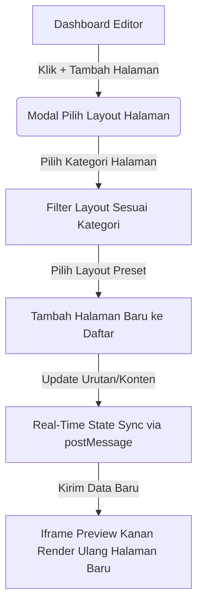

# PRODUCT REQUIREMENT DOCUMENT (PRD)
## Smart Editor & Dynamic Layout Builder Dashboard Undangan (V2)
*Terinspirasi oleh Satumomen.com V2 Editor & Disesuaikan untuk Katalog Undangan*

---

## 1. PENDAHULUAN & TUJUAN

### 1.1 Latar Belakang
Undangan digital modern saat ini menuntut tingkat kustomisasi yang jauh lebih tinggi daripada sekadar formulir statis. Pengguna tidak hanya ingin mengisi teks, tetapi juga ingin **menyusun halaman sendiri** (custom page builder), memilih variasi tata letak (layout) visual untuk setiap bagian (seperti cover, galeri, timeline, acara), mengatur ulang urutan halaman, serta melihat perubahan tersebut secara instan.

Menganalisis sistem **Satumomen V2**, keunggulan utama mereka terletak pada fitur **"Pilih Layout Halaman" (Dynamic Page Builder)**. Fitur ini memungkinkan pengguna untuk menambahkan halaman baru dari 20+ kategori dengan pilihan template layout visual yang bervariasi (mulai dari gaya minimalis, klasik, hingga mosaik premium).

### 1.2 Tujuan Utama
1. **Dynamic Page Builder**: Memberikan kemampuan bagi pengguna untuk menambah, menghapus, menyembunyikan, dan mengurutkan ulang (reorder) halaman undangan digital mereka secara modular.
2. **Multi-Layout Selector**: Menyediakan pilihan layout visual yang beragam untuk setiap tipe halaman (misalnya: 3 variasi Layout Opening, 5 variasi Layout Gallery, dll.) seperti dalam screenshot referensi.
3. **Real-time Synchronization**: Menghubungkan perubahan tata letak halaman di editor tengah langsung ke visualisasi di iframe preview kanan secara instan (tanpa reload iframe).
4. **Struktur Data JSON Modular**: Menyimpan data konten undangan secara fleksibel agar dapat menyesuaikan dengan layout apa pun yang dipilih oleh pengguna tanpa merusak struktur database utama.

---

## 2. SPESIFIKASI FITUR: DYNAMIC PAGE & LAYOUT BUILDER

Sistem ini mengubah paradigma dashboard dari "pengisian formulir satu halaman panjang" menjadi **"Wedding Page Builder"** yang modular.



### 2.1 Alur Pengguna (User Flow)
1. Pada menu navigasi utama (Sidebar Editor), terdapat daftar halaman aktif undangan. Di bagian bawah daftar halaman, terdapat tombol **`+ Tambah Halaman Baru`**.
2. Mengklik tombol tersebut akan membuka modal **"Pilih Layout Halaman"** (seperti pada screenshot referensi).
3. Di dalam modal ini:
   * Pengguna disajikan grid berisi kartu preview visual dari berbagai layout halaman.
   * Di bagian bawah, terdapat dropdown **"Kategori"** untuk menyaring layout berdasarkan tipe halaman yang ingin ditambahkan.
   * Layout premium ditandai dengan lencana mahkota emas (`👑 Premium`), sedangkan layout standar bertuliskan kategori biasa.
4. Pengguna memilih salah satu layout visual.
5. Halaman baru tersebut langsung tersemat ke dalam navigasi editor dan memicu pembaruan real-time pada iframe preview.

---

## 3. TAKSONOMI KATEGORI HALAMAN & PILIHAN LAYOUT (Berdasarkan Referensi V2)

Berdasarkan menu dropdown kategori Satu Momen V2, berikut adalah spesifikasi dari **20 kategori halaman** yang wajib didukung oleh sistem editor:

| # | Kategori Halaman (Dropdown) | Deskripsi Fungsional | Pilihan Variasi Layout Visual (Presets) |
| :-: | :--- | :--- | :--- |
| 1 | **Opening** (Layar Sapa) | Halaman pembuka yang memuat nama sapaan tamu khusus dan tombol "Buka Undangan". | • **Layout 1**: Desain lingkaran (circular frame) dengan teks klasik.<br>• **Layout 2**: Kubah/Arch frame dengan foto prewedding vertikal.<br>• **Layout 3**: Oval border dengan ornamen garis elegan modern. |
| 2 | **Profil** (Biodata) | Memperkenalkan data diri singkat masing-masing mempelai pria & wanita secara individual. | • **Layout 1**: Grid foto berdampingan (pria kiri, wanita kanan).<br>• **Layout 2**: Layout split vertikal (foto besar di atas, nama di bawah). |
| 3 | **Mempelai** | Detail gabungan pasangan, termasuk nama orang tua, silsilah keluarga, dan link media sosial. | • **Layout 1**: Minimalis dua kolom.<br>• **Layout 2**: Editorial magazine style dengan kutipan romantis di tengah. |
| 4 | **Quotes** (Kutipan/Ayat) | Halaman berisi ayat suci (QS Ar-Rum, Alkitab, dll.) atau kata mutiara pernikahan. | • **Layout 1**: Teks terpusat (centered) dengan latar belakang ornamen tipis.<br>• **Layout 2**: Foto background transparan (overlay) ditumpuk teks kutipan. |
| 5 | **Salam** (Greeting) | Ucapan pembuka yang hangat dari kedua mempelai kepada para tamu undangan. | • **Layout 1**: Teks narasi panjang dengan tanda tangan digital pasangan. |
| 6 | **Acara** | Detail informasi penyelenggaraan acara (Akad, Resepsi, dll.) lengkap dengan kalender. | • **Layout 1**: Card vertikal berjejer untuk tiap sesi acara.<br>• **Layout 2**: Desain split (kiri detail waktu, kanan foto gedung/dekorasi). |
| 7 | **Maps** (Lokasi) | Peta interaktif Google Maps dan penunjuk arah jalan (tombol navigasi Google Maps/Waze). | • **Layout 1**: Embed Google Maps penuh dengan tombol rute di bawah.<br>• **Layout 2**: Denah lokasi bergambar (sketsa) + tombol koordinat GPS. |
| 8 | **Rundown** (Susunan) | Timeline waktu jalannya acara dari pembukaan hingga selesai agar tamu mengetahui jadwal. | • **Layout 1**: Garis waktu vertikal (vertical line path) dengan ikon jam.<br>• **Layout 2**: Grid susunan acara horizontal berbentuk kartu step-by-step. |
| 9 | **Cerita Cinta** (Love Story) | Timeline perjalanan cinta dari awal bertemu hingga jenjang pernikahan. | • **Layout 1**: Garis waktu zig-zag (alternating timeline) foto kiri/kanan.<br>• **Layout 2**: Blok cerita kartu bertumpuk dengan scrolling fade-in animation. |
| 10 | **Gallery** (Galeri Foto) | Album kompilasi foto-foto prewedding pasangan dengan berbagai grid layout premium. | • **Layout 1**: Grid mosaik 5 foto asimetris.<br>• **Layout 2**: Kolase vertikal 3 foto prewedding besar dengan teks judul editorial.<br>• **Layout 3**: Grid 9-kotak simetris ala Instagram feed. |
| 11 | **Video** | Pemutar video prewedding/cinematic yang disematkan langsung di halaman undangan. | • **Layout 1**: Iframe YouTube/Vimeo player fullscreen dengan bingkai emas.<br>• **Layout 2**: Video native auto-loop minimalis dengan tombol putar/jeda. |
| 12 | **Gift** (Hadiah/Angpao) | Wadah kirim angpao digital (transfer bank, e-wallet, unggah gambar QRIS, dan kado fisik). | • **Layout 1**: Baris kartu nomor rekening bank dengan tombol salin instan.<br>• **Layout 2**: QRIS popup modal besar dengan panduan cara transfer. |
| 13 | **RSVP** (Buku Tamu) | Formulir konfirmasi kehadiran tamu (Hadir, Tidak Hadir, Jumlah Tamu) beserta ucapan. | • **Layout 1**: Formulir clean card terpusat dengan rekap pesan real-time.<br>• **Layout 2**: Kotak komentar bergaya balon chat media sosial. |
| 14 | **Dresscode** | Informasi panduan warna pakaian atau tema busana tamu yang disarankan. | • **Layout 1**: Lingkaran palet warna pakaian (color code hex circles).<br>• **Layout 2**: Contoh gambar moodboard pakaian formal/casual. |
| 15 | **Protokol** (Prokes) | Himbauan kesehatan standar penyelenggaraan acara (masker, cuci tangan, dll.). | • **Layout 1**: Baris ikon 3D/flat prokes (Masker, Jaga Jarak, Cuci Tangan).<br>• **Layout 2**: Pop-up banner himbauan saat pertama kali undangan dibuka. |
| 16 | **Mengundang** | Pengumuman formal nama pihak keluarga besar yang mengundang para tamu. | • **Layout 1**: Daftar nama keluarga besar mempelai pria dan wanita. |
| 17 | **Rundown Adat** | Susunan prosesi khusus bagi pernikahan tradisional/adat daerah. | • **Layout 1**: Penjelasan langkah-langkah ritual adat disertai foto ilustrasi. |
| 18 | **Filter** | Tautan khusus untuk membagikan Instagram Filter pernikahan pasangan. | • **Layout 1**: Banner mockup handphone yang mengarah ke link kamera IG. |
| 19 | **Live** (Streaming) | Tautan atau pemutar langsung siaran virtual melalui Zoom, YouTube Live, atau IG Live. | • **Layout 1**: Countdown hitung mundur siaran langsung + tombol "Gabung Zoom". |
| 20 | **Contact** (Panitia) | Nomor kontak penting (WhatsApp) keluarga atau organizer yang dapat dihubungi. | • **Layout 1**: Grid kontak cepat dengan tombol panggil langsung via WA. |

---

## 4. SKEMA DATABASE MODULAR (PRISMA SCHEMA)

Untuk mendukung penambahan halaman secara dinamis dengan layout yang bervariasi, kita tidak bisa menggunakan kolom database flat biasa (seperti `invitation.gallery_url` atau `invitation.cover_title`). Kita harus menggunakan skema tabel relasional yang fleksibel dengan kolom bertipe **JSON** untuk menyimpan konfigurasi konten unik dari tiap layout.

```prisma
// Contoh Skema Database Prisma (Konseptual)

model Invitation {
  id               String         @id @default(uuid())
  title            String
  slug             String         @unique
  themeId          String         // ID tema dasar (misal: "dreamy-javanese")
  themeColor       String         // Hex warna utama kustom
  fontTitle        String         // Font kustom judul
  fontBody         String         // Font kustom teks tubuh
  musicUrl         String?        // URL lagu latar
  musicAutoplay    Boolean        @default(true)
  
  // Relasi ke halaman-halaman dinamis
  pages            InvitationPage[]
  
  createdAt        DateTime       @default(now())
  updatedAt        DateTime       @updatedAt
}

model InvitationPage {
  id               String         @id @default(uuid())
  invitationId     String
  invitation       Invitation     @relation(fields: [invitationId], references: [id], onDelete: Cascade)
  
  category         String         // e.g., "Opening", "Gallery", "LoveStory", "Gift"
  layoutId         String         // ID layout visual, e.g., "gallery-mosaic", "opening-arch"
  order            Int            // Urutan render halaman (sorting order)
  isEnabled        Boolean        @default(true) // Untuk menyembunyikan halaman tanpa menghapus
  
  // Konten dinamis yang diisi oleh form editor disimpan dalam format JSON.
  // Struktur JSON ini menyesuaikan dengan kebutuhan layoutId yang dipilih.
  content          Json           
  
  createdAt        DateTime       @default(now())
  updatedAt        DateTime       @updatedAt

  @@unique([invitationId, order])
}
```

### Contoh Isi Kolom `content` (JSON):
*   **Untuk Halaman `category: "Opening"`, `layoutId: "opening-arch"`**:
    ```json
    {
      "title": "The Wedding of",
      "coupleNames": "Andi & Sari",
      "eventDate": "2026-08-20T09:00:00Z",
      "backgroundImage": "https://res.cloudinary.com/uploads/cover-bg.jpg",
      "frameStyle": "arch"
    }
    ```
*   **Untuk Halaman `category: "Gallery"`, `layoutId: "gallery-mosaic"`**:
    ```json
    {
      "title": "Our Precious Moments",
      "images": [
        {"url": "https://cdn.com/pic1.jpg", "caption": "Prewedding 1"},
        {"url": "https://cdn.com/pic2.jpg", "caption": "Prewedding 2"},
        {"url": "https://cdn.com/pic3.jpg", "caption": "Prewedding 3"}
      ],
      "aspectRatio": "3:4"
    }
    ```

---

## 5. MEKANISME RENDERING PREVIEW & REAL-TIME SYNC

Agar performa browser tetap optimal ketika pengguna menambah halaman atau mengganti layout, proses render di sisi preview (iframe) dioptimalkan dengan cara berikut:

1. **Inisialisasi Awal**: Iframe memuat data undangan utama (`Invitation` beserta array `pages` yang sudah terurut berdasarkan kolom `order`).
2. **Kirim Perubahan Parsial**: Ketika pengguna mengklik layout baru di editor, dashboard tengah mengirimkan event `postMessage` berisi daftar halaman terbaru.
3. **Hot-reload State**: Komponen React di dalam template (iframe) melakukan pembaruan state lokal secara reaktif. Framer-motion akan menganimasikan masuknya halaman baru dengan transisi halus (`opacity` atau `slide-in`).

---

## 6. SPESIFIKASI ANTARMUKA PENGGUNA (UI/UX) DI DASHBOARD EDIT

### 6.1 Panel Pengelola Halaman (Sidebar Editor Tengah)
*   **Daftar Halaman Aktif**: Menampilkan list kartu kecil yang merepresentasikan setiap halaman undangan yang telah dibuat pengguna (misal: "1. Cover", "2. Mempelai", "3. Acara", "4. Galeri").
*   **Fitur Drag-and-drop Sorting**: Pengguna dapat menggeser urutan kartu tersebut ke atas/bawah untuk mengubah urutan tampilannya pada undangan digital secara instan.
*   **Toggles & Aksi Cepat**:
    *   Ikon **Mata** (`👁️`): Mengaktifkan/menyembunyikan halaman dari undangan tanpa harus menghapusnya (mengubah state `isEnabled`).
    *   Ikon **Sampah** (`🗑️`): Menghapus halaman secara permanen dengan konfirmasi popup.
    *   Ikon **Salin** (`📋`): Menggandakan halaman (sangat berguna untuk halaman berulang seperti multi-acara atau kontak).

### 6.2 Modal "Pilih Layout Halaman"
*   **Header**:
    *   Judul: "Pilih Layout Halaman".
    *   Tombol Close (`✕`).
*   **Body**:
    *   **Grid layout preview**: Menampilkan mockup kartu visual tata letak halaman yang bersih dengan ilustrasi placeholder foto/teks (seperti pada screenshot).
    *   **Efek Hover**: Kartu layout akan membesar sedikit dan memunculkan border merah muda (`#e91e63`) saat disorot kursor.
*   **Footer**:
    *   **Dropdown Saringan (Filter)**: Berisi pilihan kategori halaman (Opening, Love Story, Quotes, Profil, Salam, Mempelai, Acara, Maps, dll.) untuk memfilter koleksi layout yang ditampilkan secara cepat.

### 6.3 Modal "Pilih Tema" (Theme Selection Engine)
Berbeda dengan "Layout Halaman" yang mengatur blok konten per blok, modal **"Pilih Tema"** berfungsi untuk mengganti *Template Dasar* (Base Template) undangan secara keseluruhan (seperti mengganti skin dasar, warna aksen global, font keluarga, dan aset ornamen utama).
*   **Header & Filter**:
    *   Terdapat dropdown **Kategori** (misalnya: Tradisional, Modern, Islami, Minimalis).
    *   Bilah pencarian (Search bar) **"Cari Tema..."** untuk menemukan tema berdasarkan nama (misalnya "Butterfly" atau "Melayu").
*   **Grid Tema (Body)**:
    *   Menampilkan thumbnail visual memanjang (portrait) dari tema-tema yang tersedia (seperti *Blue Butterflya*, *Minimalist Cream*, *Melayu Padang*, dll.).
    *   Terdapat lencana/ikon mahkota emas **👑 Premium** untuk membedakan tema eksklusif.
    *   Saat diklik, tema akan masuk ke status *selected* (dipilih) sebelum disimpan.
*   **Footer Actions**:
    *   Tombol **"Request Tema"** (Abu-abu): Mengarahkan pengguna ke formulir kontak/WhatsApp untuk memesan tema kustom yang belum ada di katalog.
    *   Tombol **"Simpan Perubahan"** (Hijau tosca/Warna primer): Untuk menerapkan tema dasar baru ke undangan digital pengguna dan langsung menyinkronkan aset global di iframe preview.

### 6.4 Modal "Pengaturan Umum" (Global Settings, SEO & Share Preview)
Berdasarkan referensi, tombol pengaturan global ini berfungsi mengatur **Meta-data Induk** dari undangan, terutama mengatur bagaimana tautan (link) terlihat saat dibagikan ke WhatsApp atau media sosial (OpenGraph meta tags), serta pengaturan bahasa dan waktu utama.
*   **WhatsApp Share Preview (OpenGraph)**:
    *   **Tampilan Share di WhatsApp**: Kotak pratinjau (preview box) interaktif yang menyimulasikan tampilan *link* saat dibagikan. Pengguna dapat mengklik ikon kamera (**Ganti Foto**) untuk mengunggah gambar *thumbnail* khusus untuk WhatsApp.
*   **Pengaturan Dasar & Lokalisasi**:
    *   **Bahasa**: Toggle/Radio button untuk memilih bahasa antarmuka bawaan undangan (opsi: **Indonesia** atau **English**).
    *   **Link Undangan / Domain**: Input teks untuk mengustomisasi *slug* URL (misal: `mutmainnah-and-adnan`).
*   **Meta Teks (SEO & OpenGraph)**:
    *   **Judul**: Input teks untuk meta title website (misal: *The Wedding of Nina & Adnan*).
    *   **Deskripsi Singkat**: Textarea untuk mengisi paragraf undangan yang akan muncul di bawah judul saat tautan dibagikan (meta description).
    *   **Label**: (Opsional) Input field untuk menyematkan label khusus pada undangan.
*   **Data Acara Utama (Global Event Data)**:
    *   **Tgl Acara Utama**: Datepicker untuk menyetel tanggal inti (biasanya digunakan sebagai acuan *Countdown Timer* utama di layar *Cover*).
    *   **Waktu Acara Utama**: Timepicker jam acara inti dimulai.
    *   **Zona Waktu**: Dropdown zona waktu (WIB, WITA, WIT).
    *   **Alamat Acara**: Textarea alamat lengkap gedung acara utama.
*   **Footer**:
    *   Tombol **"Simpan Perubahan"** untuk mengunci semua pengaturan meta-data induk.

### 6.5 Modal "Music" (Backsound Manager)
Modal untuk mengatur musik latar (backsound) yang akan terputar otomatis saat undangan dibuka.
*   **Toggle Utama**:
    *   **Pengaturan Aktif**: Switch untuk menghidupkan/mematikan fitur musik latar.
*   **Sumber Musik (Music Source)**:
    *   Dropdown untuk memilih sumber musik (misal: "Default" atau "Custom").
    *   **Upload file MP3**: Area *drag-and-drop* untuk mengunggah file MP3 custom (Maksimal 5 MB). Di referensi, fitur ini terintegrasi dengan sistem kredit/koin ("Biaya: -10 Credit").
*   **Pustaka Musik (Library)**:
    *   Bilah pencarian **"Cari Music..."** dan filter **Kategori**.
    *   Daftar lagu bawaan sistem (contoh: *Goo Goo Dolls - Iris*, dll.).
    *   Tiap item lagu memiliki tombol "Play" (mendengarkan sampel) dan tombol **"Gunakan"**.

### 6.6 Modal "Background Utama" (Global Background Override)
Modal simpel yang berfungsi menimpa (override) latar belakang bawaan tema secara global.
*   **Informasi**: Pesan *alert* "Merubah background ini akan merubah keseluruhan background halaman."
*   **Pilihan Background**: Menampilkan *preview* gambar yang sedang aktif bersanding dengan area **"Upload Background"** khusus.

### 6.7 Modal "RSVP Settings" (Buku Tamu & Kehadiran)
Modal sangat *advanced* untuk mengontrol privasi dan formulir kehadiran tamu secara dinamis.
*   **Pengaturan Visibilitas & Aturan**:
    *   **Fitur RSVP Aktif**: Toggle switch menyalakan/mematikan formulir.
    *   **Siapa Yang Boleh Mengisi**: Dropdown akses (contoh: "Semua tamu undangan").
    *   **Tampilkan Komentar Ke Publik**: Mengontrol apakah ucapan tamu lain bisa dibaca secara umum.
    *   **Tombol Konfirmasi Ulang & Download QR**: Toggle untuk fitur *check-in* di venue.
    *   **Default Country Code**: Dropdown kode negara WA (contoh: *Indonesia +62*).
*   **Kustomisasi Kolom Inputan (Dynamic Form Builder)**:
    Memungkinkan pemilik undangan menyaring field form apa saja yang akan dilihat oleh tamu. Label tiap form juga bisa di-edit kustom (melalui ikon pensil ✏️).
    *   **Nama** (Wajib).
    *   **Grup**, **No WhatsApp**, **Kehadiran**, **Jumlah Tamu**, **Komentar atau Ucapan** (Semua dilengkapi toggle Aktif/Nonaktif).
*   **Custom Input**: Tombol **"Tambah Inputan"** untuk membuat form pertanyaan tambahan (misal: *Pilih Menu Makanan?*, *Butuh Penginapan?*).
*   **Footer**: Tombol hijau **"Simpan Perubahan"**.

---

> [!IMPORTANT]
> **Rencana Eksekusi Kode untuk Langkah Selanjutnya:**
> 1. Apakah Anda ingin kita mulai dengan **membuat modul formulir panel pengelola halaman (Sidebar Editor) di [page.tsx](file:///c:/Users/ALPA%20STORE PALU/katalog-undangan/src/app/member/dashboard/page.tsx)** dan merancang struktur tampilan kartu-kartu halamannya?
> 2. Kita bisa mendesain **Modal "Pilih Layout Halaman"** lengkap dengan grid preview visual dan filter kategori dropdown persis seperti yang Anda lampirkan di screenshot di atas agar visualnya memukau (premium design)!
> 
> Mohon berikan masukan Anda terlebih dahulu sebelum saya menulis kode apa pun!
